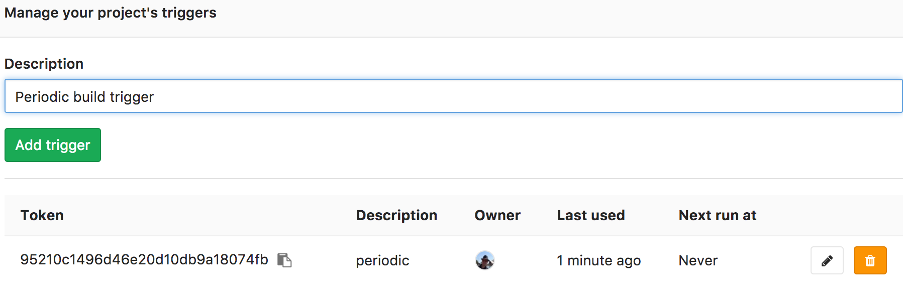

I am using GitLab CI now for more than a year and I really love the features in GitLab. GitLab provides a complete and powerful tool for day to day development. And of course, there are always feature that you miss. Until now there is no support for periodic builds, in the coming release the [feature](https://gitlab.com/gitlab-org/gitlab-ce/issues/2989) will be shipped as experimental feature and in the next one is should be general available. But in case you must deal for some reason with an older version, a work around is described below as I used last year.

You could argue why you should need a feature as a periodic build. Ideally a build should be immutable and only trigger by a change in GIT, a commit. But the world is not always perfect, project build are sometime not of the quality that you are expect or tools are not that reliable as you hope. For example, dependencies resolving could break over the time, to avoid you find the problem once your boss is watching you when fixing a critical bug, a periodic build can alert you earlier. Another and much better reason to argue for the feature is that the GitLab build are so powerful that is handy to use them for a scenario based health check.

## The build trigger
To setup a periodic build you first need to be able to trigger a build in some way. GitLab provides an [API](https://docs.gitlab.com/ce/ci/triggers/) to trigger a build. Setting up the trigger is simple and complete guided in GitLab, just execute the steps below:

- Go to your GitLab projects
- Navigate to Settings -> CI/CD Pipelines
- Scroll down to the trigger section and create a trigger
- Make a note of the TOKEN and trigger URL. An curl example for trigger is shown as well.

<a href="#">
    
</a>

Next we test that we are able to trigger the build remotely be executing the `curl` command below.

```
curl -X POST \
     -F token=<TOKEN> \
     -F ref=<REF_NAME> \
     <URL>
```
Verify in GitLab the build is triggered

## Periodic trigger the build in a Docker container
The next step is to execute the trigger periodic. A standard way of running a job periodic is by defining crontab. We will use a docker container to execute the crontab so we can deploy it anywhere.

I have createe a base docker image containing a script to trigger GitLab by executing a curl command as shown above. The crontab will be copied to the image `ONBUILD`. In the crontab we point to the script that can be executed as follow:
```
trigger-gitlab.sh -t <token> -r <ref> -u <gitlab_trigger_url>
```
For the sources see [npalm/gitlab-periodic-trigger](https://github.com/npalm/gitlab-periodic-trigger) on GitHub.

Now all peace’s are ready we only have to build our docker image and run it to trigger the build. First, we create a Dockerfile and only extend the base image `npalm/gitlab-periodic-trigger`. Create a new directory, and add a Dockerfile with only the line:
```
FROM npalm/gitlab-periodic-trigger:1.0.0
```
This image expects a file `gitlabcrontab` containing the [crontab](https://en.wikipedia.org/wiki/Cron) and will copy it to the image once build. Create a file named `gitlabcrontab`, and add one ore more triggers, an example is below.

```
# Example of job definition:
# .---------------- minute (0 - 59)
# |  .------------- hour (0 - 23)
# |  |  .---------- day of month (1 - 31)
# |  |  |  .------- month (1 - 12) OR jan,feb,mar,apr ...
# |  |  |  |  .---- day of week (0 - 6) (Sunday=0 or 7)
# |  |  |  |  |
22 11 * * * trigger-gitlab.sh -t <token> -r <ref> -u <gitlab_trigger_url>
```
Now we build the container `docker build -t periodic-trigger .` and finally start the container `docker run -d periodic-trigger`

To enable the feature for your teams you could set up a build to build the docker image as described below and push it automated to an environment.
