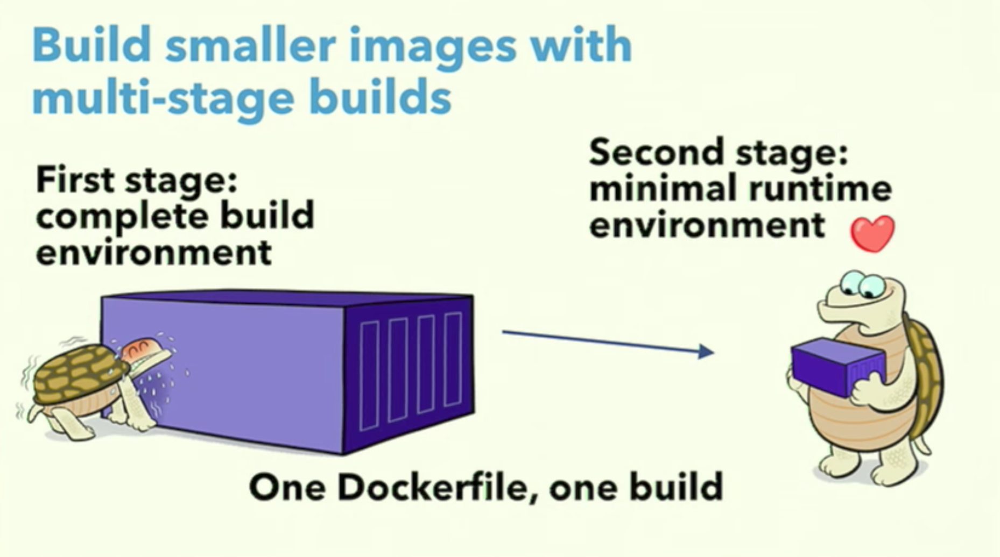

# The problem
Building an application requires typically multiple steps. First compiling the application, next testing it and finally shipping the artifact in a Docker image for execution. All these steps can be combined in one `Dockerfile`, but typically you end up with a Docker image that contains all kinds of tools that are not necessary for running the application.

We could try to get rid of all unneeded files in the image after build, but a more useful approach is to separate Docker images for building and running the application. However, this approach requires two separate Dockerfiles that needs to be maintained.

Let’s have a look on a [example](https://github.com/040code/blog_docker-mulit-stage-build.git) for a simple Java micro service. The micro services require the JDK and Gradle to build. The JDK needs to be installed before the build and Gradle will be download by the build itself. We can build the micro service in the following way.

```
git clone https://github.com/040code/blog_docker-mulit-stage-build.git
cd notes-service
docker run -it --rm -v $(pwd):/build -w /build openjdk:8u121-jdk-alpine ./gradlew build
```
Now the artifact is available, we can create a Docker runtime image. The application only needs the Java Runtime (JRE) to run. We create a `Dockerfile` based JRE alpine image and add our application.

```
# file: Dockerfile (git checkout step-00)
FROM openjdk:8u121-jre-alpine
COPY build/libs/notes-service.jar /app/notes-service.jar

EXPOSE 8080
CMD java -jar /app/notes-service.jar
```
Next, we build the production image as follows:
```
docker build -t notes-service:00 .
```
Now we have created a clean Docker images that only containes the needed libraries to run the application. But would it not be nice if we can do this more straightforward? For example, in one Docker build.

# Moving on to a multi stage build
Docker 17.05.x brings a new feature; it is now possible to define a [multi stage builds](https://docs.docker.com/engine/userguide/eng-image/multistage-build/) in one Dockerfile. The Dockerfile can contain multiple FROM lines and each stage starts with a new FROM line and a fresh context. You can copy artifacts from stage to stage.

<a href="#">
    
</a>

Now it is time to have a second look on the same example. Instead of passing the build arguments and mounting our sources, we will build our software using a single Dockerfile.

```
# file: Dockerfile (git checkout step-01)
FROM openjdk:8u121-jdk-alpine AS build

WORKDIR /build-env
ADD . /build-env
RUN ./gradlew build

CMD java -jar /build-env/build/notes-service.jar
```
And build it:
```
docker build -t notes-service:01 .
```
Nothing new here, we are now able to build our software in a container and ship an image, but the image contains all kinds of build stuff that we do not want in a runtime image. So, the next step is to solve this problem by getting rid of all the unwanted build tools.

We update the `Dockerfile` and make a few modifications.
```
# file: Dockerfile (git checkout step-02)
FROM openjdk:8u121-jdk-alpine AS build                                               # (1)

WORKDIR /build-env
ADD . /build-env
RUN ./gradlew build

FROM openjdk:8u121-jre-alpine                                                        # (2)
COPY --from=build /build-env/build/libs/notes-service.jar /app/notes-service.jar     # (3)

EXPOSE 8080
CMD java -jar /app/notes-service.jar
```
In the `Dockerfile` above we marked the first stage (1) as *build* to refer later, if not specifying a name you can refer to the stage as 0. Next (2), we add the second stage which specifies the base image that we need to run our application. Finally (3), we copy the results from the build stage to the image for executing.
```
docker build -t notes-service:02 .
```
And now we can run via the following docker run command.
```
docker run -it --rm -p 8080 notes-service:2
```
Inspection of the tree images build will show that version 0 and 2 are equal in size, version 1 that contains all the build files and the JDK is almost three times bigger.

# Conclusion
Docker's new multi layer build feature can be quite useful when build pipeline without parallel builds will suite your needs. In that case, you can reduce your build to a single image. For projects that requires a more complex multi stage build, including parallel builds, this new Docker feature will not provide an added value.
