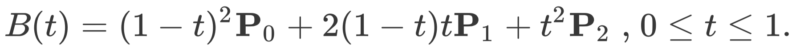
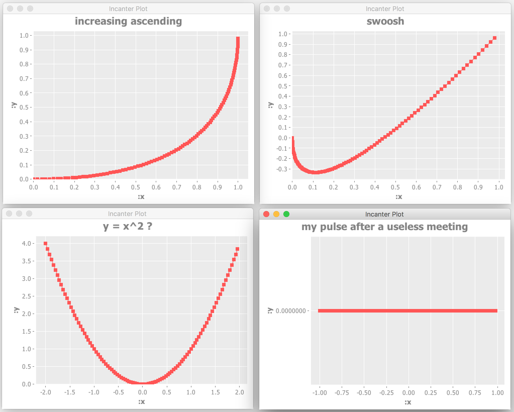

For reasons I might explain in another post, I was reading about [Bézier curves on wikipedia](https://en.wikipedia.org/wiki/Bézier_curve) the other day. Especially the paragraph on "Constructing Bézier curves" made me understand intuitively how these curves are constructed. I wondered if `clojure` could help me easily visualise some of these curves so I fired up a [REPL](https://en.wikipedia.org/wiki/Read–eval–print_loop) (Read-Eval-Print-Loop) to investigate.

## Setup

I assume you have a working [leiningen](https://leiningen.org) setup with the [lein-try plugin](https://github.com/rkneufeld/lein-try) installed.

- Leiningen will help you get started with `clojure` right away from your shell
- Lein-try enables you to spin up a repl and try a library without any hassle.

Let's first start a repl, and specify the library we want to try:

```bash
lein try incanter "1.5.7"
```

[Incanter](http://incanter.org) is a `clojure`-based, R-like platform for statistical computing and graphics. We'll use it to visualise the Bézier curves.

Since the repl is already fired up, let's immediately require the dependencies we'll need:

```clojure
(require '[incanter.core   :as incanter])
(require '[incanter.charts :as charts])
```

Nothing fancy going on here. Simply 'import' statements the `clojure` way.

## Helper function

I decided to hand-roll my own `pow` function, because we'll need it later in the creation of bézier curves:

```clojure
(defn pow [base exponent]
  (reduce *' (repeat exponent base)))
```

This function basically says:

- define a function named `pow`
- let `base` and `exponent` be its arguments
- make it `repeat` the `base` `exponent` times
- and `reduce` that result with the `*'` multiply function


```clojure
;; so:
(pow 2 3)
;; will lead to
(reduce *' [2 2 2])
;; which results in
8
```

I'm using the `*'` multiply function instead of the normal `*` multiply function, because according to the docs `*'` supports arbitrary precision. You can see for yourself by typing `(doc *')` in your repl, or study the code by typing `(source *')` in your repl.

## Bézier

Bézier functions work with control points. The minimum number of control points is 2 and Bézier curves with 2 control points are straight lines (although you can also create straight lines with more than 2 control points).

For the moment I only need Bézier curves with 3 control points: a start point, an end point and one point controlling the curve of the line between start and end.

Quoting the [Wikipedia page](https://en.wikipedia.org/wiki/Bézier_curve): "A quadratic Bézier curve is the path traced by the function B(t), given points P0, P1, and P2":

<a href="#">
    
</a>

So given 3 points (P0, P1 and P2) I should be able to describe the curve with this math function. Conceptually a pen is drawing the curve by starting on P0 on moment `t = 0` and following the curve described by this formula and the position of the 3 points until it hits the end point at `t = 1`. The only thing this resulting `B(t)` function needs is the moment `t` and it will calculate the X or Y coördinate at that particular moment.

Let's convert the math function to `clojure`:

```clojure
(defn bezier-3 [P0 P1 P2]
  (fn [t]
    (+
      (* (pow (- 1 t) 2) P0)
      (* 2 (- 1 t) t     P1)
      (* (pow t 2)       P2))))
```

As you can see, you'll have to translate the infix notation to `clojure`'s prefix notation. The advantage is there are no precedence rules to remember anymore. These are all just lists where the first element of the list is interpreted as a function to call and the brackets are used to put them into context. _(If you can't live with that: you can also use infix notation in clojure. For instance incanter can also be fed with [infix notation](https://data-sorcery.org/2010/05/14/infix-math/). However, you'll lose [the power of the 𝝺](https://en.wikipedia.org/wiki/Lambda_calculus))_

This function basically states:

- define a function named `bezier-3`
- let it have 3 arguments: `P0`, `P1` and `P2`
- make it return an anonymous function

This anonymous function:

- takes `t` as an argument
- has `P0`, `P1` and `P2` already 'injected'
- applies the Bézier math function

Excellent. Let's try it:

```clojure
(def test-b3 (bezier-3 1 1 0))

(test-b3 0)
=> 1
```

Here I'm defining a variable `test-b3` which holds the anonymous function returned by the `bezier-3` function call. The 3 points are either all x or all y coordinates of the points P0, P1 and P2.

With the `(test-b3 0)` function call I'm calling the anonymous function with a `t` value of `0`. This nicely returns an answer representing the x coordinates at moment `t` if you provided the (P0, P1 and P2) x coordinates when calling the `bezier-3` function or the y coordinate at moment `t` if you provided the (P0, P1 and P2) y coordinates.

Since this test didn't blow the stack or throw a NullPointerException or anything,  let's map this function over a range of `t`'s `[0 0.25 0.5 0.75 1]`:

```clojure
(map test-b3 [0 0.25 0.5 0.75 1])
=> (1 0.9375 0.75 0.4375 0)
```

Instead of typing these `t`'s to `map` over, we could also use the `range` function:

```clojure
(range 0 10)
=> (0 1 2 3 4 5 6 7 8 9)

(range 0 10 2)
=> (0 2 4 6 8)
```

As you can see, `range` allows you to specify a start (inclusive), an end (exclusive) and a step size (optional).

```clojure
(map test-b3 (range 0 1 0.1))
=> (1 0.9900000000000001 0.9600000000000002 0.9099999999999999 0.84 0.75 0.64 0.51 0.3600000000000001 0.19000000000000014 2.220446049250313E-16)
```

Although a certain pattern is already visible in these numbers, now might be the right time to start visualising the curves.

## Visualise

Let's be brave and go right to the essence:

```clojure
(defn view-bezier-plot [[x1 y1] [x2 y2] [x3 y3] plot-title]
  (let [b3x         (bezier-3 x1 x2 x3)
        xs          (map b3x (range 0 1.0 0.01))
        b3y         (bezier-3 y1 y2 y3)
        ys          (map b3y (range 0 1.0 0.01))
        dataset     (incanter/conj-cols xs ys)
        xy-plot     (charts/xy-plot "col-0" "col-1" :data dataset :points true :title plot-title)]
    (incanter/view xy-plot)))
```

The `let` form is `clojure`'s way of defining local variables. So `b3x`, `xs`, `b3y`, etc. can be seen as local variables with their values specified in the functions directly after their declaration.

This function basically states:

- define a function named `view-bezier-plot`
- let it have 3 arguments which are destructured into their 2D x & y coordinates
- let the fourth argument be the title of the plot
- `let` it have some local variables:
	- `b3x` takes all x coordinates of the 3 points
	- `b3y` takes the y coordinates
	- `xs` are the all x values resulting from applying the `b3x` anonymous function with all the range values
	- `ys` are the all y values resulting from applying the `b3y` anonymous function with all the range values
	- incanter can work with columns similarly to spreadsheets. `dataset` is an incanter dataset where 2 columns are 'brought together', or in [lisp](https://en.wikipedia.org/wiki/Lisp_(programming_language)) terms `conj`[oined]. By default, these columns are called `col-0`, `col-1`, ... , `col-n`
	- xy-plot contains an incanter chart where `dataset` provides the data, the x-axis - and y-axis values are found in columns `col-0` and `col-1` respectively and viewing the points is set to `true`
- and make it return an `xy-plot`


## I love it when a plan comes together

```clojure

(view-bezier-plot [0 0] [1 0] [1 1] "increasing ascending")

(view-bezier-plot [0 0] [0 -1] [1 1] "swoosh")

(view-bezier-plot [-2 4] [0 -4] [2 4] "y = x^2 ?")

(view-bezier-plot [-1 0] [0 0] [1 0] "my pulse after a useless meeting")

```

<a href="#">
    
</a>

The generated charts will be opened in external java windows. Sometimes they stay hidden behind other windows on your screen, so you might have to bring your java windows to the foreground in order to see them.

## Conclusion

In a relatively short repl session I was able to get a better understanding of (3 point) Bézier curves. Although the blogpost is long, not much code or time was needed to create the curves:

```clojure
(require '[incanter.core   :as incanter])
(require '[incanter.charts :as charts])


(defn pow [base exponent]
  (reduce *' (repeat exponent base)))


(defn bezier-3 [P0 P1 P2]
  (fn [t]
    (+
      (* (pow (- 1 t) 2) P0)
      (* 2 (- 1 t) t     P1)
      (* (pow t 2)       P2))))


(defn view-bezier-plot [[x1 y1] [x2 y2] [x3 y3] plot-title]
  (let [b3x         (bezier-3 x1 x2 x3)
        xs          (map b3x (range 0 1.0 0.01))
        b3y         (bezier-3 y1 y2 y3)
        ys          (map b3y (range 0 1.0 0.01))
        dataset     (incanter/conj-cols xs ys)
        xy-plot     (charts/xy-plot "col-0" "col-1" :data dataset :points true :title plot-title)]
    (incanter/view xy-plot)))
```

Actually, the hand-rolled `pow` function isn't really needed. I could have used `clojure`'s java interop: `(Math/pow 2 3)`. In that case I would have been calling the `pow` method directly on java's `Math` class. I weighted the option of hand-rolling the `pow` function, showing some functional code and explaining how functions are defined in `clojure` versus explaining java interop.

Explaining in text what the code does took me 5 times as long as writing the code itself. That's a great thing about [lisps](https://en.wikipedia.org/wiki/Lisp_(programming_language)) in general and `clojure` in particular: no fluff, just stuff!

Thanks Niek for posting my guest blog. Please share your comments, suggestions and thoughts about this blog with me on [twitter.com/mmz_](https://twitter.com/mmz_). Thanks for reading and Happy Coding!

## Links

- [A gist with the code from this post](https://gist.github.com/mmzsource/833ddfb2cf87c54fe4fc26996466cd1d)
- [Clojure website](https://clojure.org)
- [Lisps or LIst Processing Language](https://en.wikipedia.org/wiki/Lisp_(programming_language))
- [𝝺 calculus](https://en.wikipedia.org/wiki/Lambda_calculus)
- [REPL or Read Eval Print Loop](https://en.wikipedia.org/wiki/Read–eval–print_loop)
- [REPL Driven Development](http://www.davidtanzer.net/rdd_and_tests) - a blog which is a bit outdated on the test part, because nowadays, with [clojure spec](https://clojure.org/about/spec) we easily generate our tests and test data by specifying our data structures, functions, etc. in `clojure` itself. With proper specs, you'll get even more than generative testing; you'll get validation, better error reporting, destructuring and type- and range checking in one go - without losing the power & pleasure of a dynamic programming language!
- [Leiningen](https://leiningen.org)
- [Lein-try plugin](https://github.com/rkneufeld/lein-try)
- [Incanter](http://incanter.org)
- [Incanter infix notation](https://data-sorcery.org/2010/05/14/infix-math/)
- [Wikipedia page on Bézier curves](https://en.wikipedia.org/wiki/Bézier_curve)
- [The formula for a bezier curve](https://plus.maths.org/content/formula-bezier-curve)
- [Play around with bézier curves with 4 control points](http://blogs.sitepointstatic.com/examples/tech/canvas-curves/bezier-curve.html)
