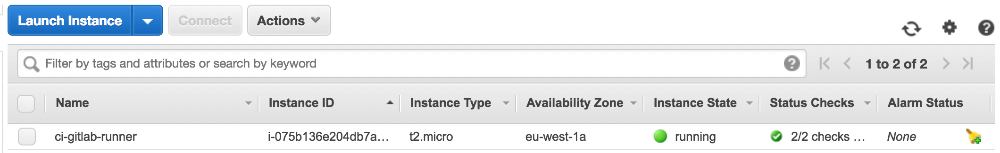
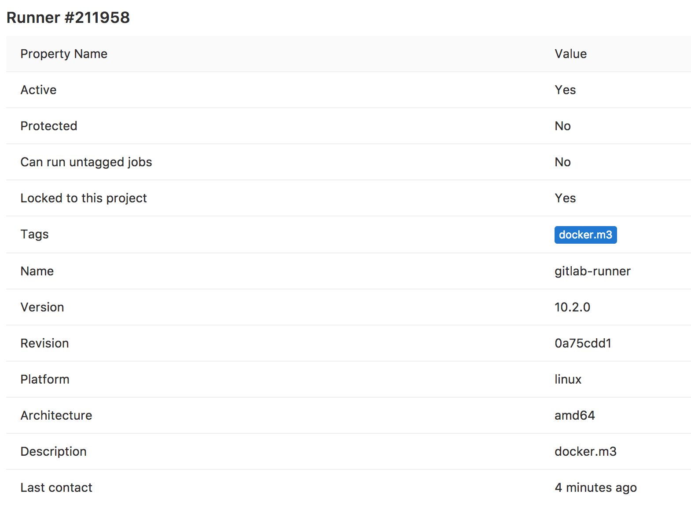
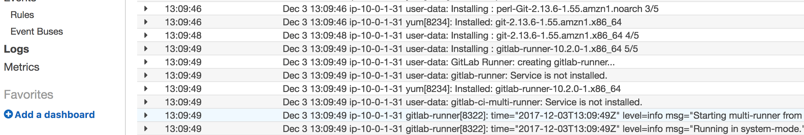
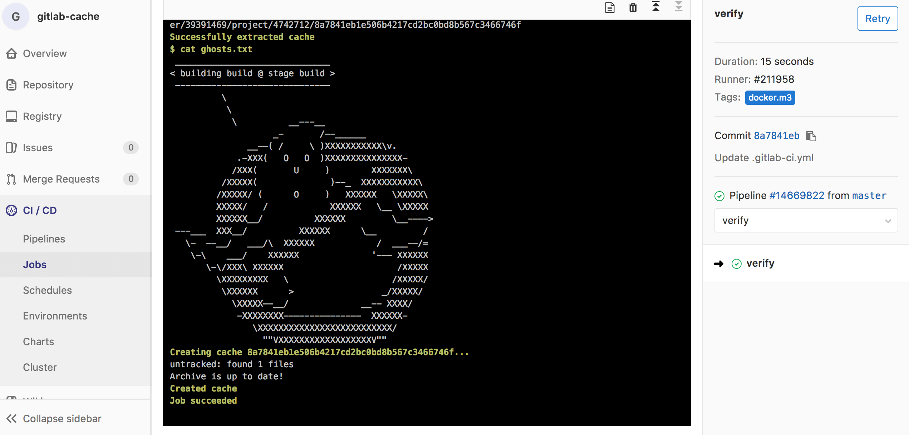

## Introduction

[GitLab CI](https://about.gitlab.com/features/gitlab-ci-cd/) is a first class citizen in GitLab to enable continuous integration and delivery to your project. Builds are orchestrated via [GitLab Runners](https://docs.gitlab.com/runner/), which are agents registered to your GitLab account. An agent runs builds using a local shell or a container. Runnings these builds requires a well-defined infrastructure, both with respect to the type of server and the server capacity. Would it not be great if you can scale the infrastructure based on your needs? Indeed, GitLabs runner supports out of the box auto scaling using docker machine, which is discussed in the GitLab blog article: [Autoscale GitLab CI runners and save 90% on EC2 costs](https://about.gitlab.com/2017/11/23/autoscale-ci-runners/).

The GitLab blog article nicely explains how to create your infrastructure in a manual way. However, we rather automate all things. Thus, we will automate the set up described in the blog article. In this post I will discuss how to create the infrastructure needed to run the build on AWS spot instances with [Hashicorp Terraform](https://www.terraform.io/). The GitLab Runner module discussed in the post is available in the [Terraform Registery](https://registry.terraform.io/modules/npalm/gitlab-runner/aws/0.1.0).

<a href="#">
    
</a>

## Prerequisites
Before we start, we need to briefly discuss the GitLab runners. To execute the builds, GitLab uses an agent to orchestrate the build with a docker machine. A docker machine creates instances with docker engine to run docker containers. The first step for setting up a runner is to register a new runner. Because GitLab currently does not provide a fully automated way for this, we will do this manually.

Open you GitLab project and lookup the token to register a runner. Be aware that there are project tokens and a GitLab global token. Next, we use a docker container to register a runner. The command will ask a few details.
```
docker run -it --rm gitlab/gitlab-runner register
```

<asciinema-player src="assets/2017-12-09_runners-on-the-spot/asciinema/register.json"
  cols="166" rows="15" autoplay="true" loop="true" speed="1.5">
</asciinema-player>


Provide the requested details and consult the GitLab manual for more details. Once done, you should see a new runner registered at your project or globally. Open the runner settings in edit mode and record the token. This token is needed later for connecting the agent.

## Creating infrastructure for the runners
Now the runner is configured in GitLab, we can start creating the infrastructure on AWS. For setting up the network layers, we use [Amazon networking scenario 2](http://docs.aws.amazon.com/AmazonVPC/latest/UserGuide/VPC_Scenario2.html) to build a VPC with a public and private subnets. For more details see this [post](2017/06/18/terraform-aws-vpc/) about creating a VPC in terraform. You can also simply use the [official terraform module](https://registry.terraform.io/modules/terraform-aws-modules/vpc/aws/1.7.0).


```

module "vpc" {
  source  = "terraform-aws-modules/vpc/aws"
  version = "1.5.1"

  name = "vpc-${var.environment}"
  cidr = "10.0.0.0/16"

  azs             = ["eu-west-1a", "eu-west-1b", "eu-west-1c"]
  private_subnets = ["10.0.1.0/24", "10.0.2.0/24", "10.0.3.0/24"]
  public_subnets  = ["10.0.101.0/24", "10.0.102.0/24", "10.0.103.0/24"]

  enable_nat_gateway = true

  tags = {
    Environment = "${var.environment}"
  }
}
```

Next, we create a `t2.micro` instance using an autoscaling group in the private network. On this instance we install and configure the GitLab runner. Configuration of GitLab runners is done via the `config.toml` file. Below the parameterized version of this configuration file. In the Terraform module you will find that the configuration file is loaded via a data template.

```
concurrent = ${runner_concurrent}
check_interval = 0

[[runners]]
  name = "${runners_name}"
  url = "${gitlab_url}"
  token = "${runners_token}"
  executor = "docker+machine"
  limit = ${runners_limit}
  [runners.docker]
    tls_verify = false
    image = "docker:17.11.0-ce"
    privileged = ${runners_privilled}
    disable_cache = false
    volumes = ["/cache"]
    shm_size = 0
  [runners.cache]
    Type = "s3"
    ServerAddress = "s3-${aws_region}.amazonaws.com"
    AccessKey = "${bucket_user_access_key}"
    SecretKey = "${bucket_user_secret_key}"
    BucketName = "${bucket_name}"
    Insecure = false
  [runners.machine]
    IdleCount = ${runners_idle_count}
    IdleTime = ${runners_idle_time}
    MachineDriver = "amazonec2"
    MachineName = "runner-%s"
    MachineOptions = [
      "amazonec2-access-key=${access_key}",
      "amazonec2-secret-key=${secret_key}",
      "amazonec2-instance-type=${instance_type}",
      "amazonec2-region=${aws_region}",
      "amazonec2-vpc-id=${vpc_id}",
      "amazonec2-subnet-id=${subnet_id}",
      "amazonec2-private-address-only=true",
      "amazonec2-request-spot-instance=true",
      "amazonec2-spot-price=${spot_price_bid}",
      "amazonec2-security-group=${security_group_name}"
    ]
```

All variables can be configured and most of them have default values. Only the name of the runner, the token and the GitLab URL need to be configured. The configuration contains a shared cache in S3 which will expire at the end of the next day (after creation) by default. Files will be deleted via S3 lifecycle management once expired, but the number of expiration days can be changed to your needs. You can find all the available variables in the `variables.tf` file of the module. Next we add the module to our Terraform file and define a minimal set of variables.

```
module "gitlab-runner" {
  source = "npalm/gitlab-runner/aws"

  aws_region     = "<region-to-use>"
  environment    = "ci-runners"
  ssh_public_key = "<contains-public-key"

  vpc_id                  = "${module.vpc.vpc_id}"
  subnet_id_gitlab_runner = "${element(module.vpc.private_subnets, 0)}"
  subnet_id_runners       = "${element(module.vpc.private_subnets, 0)}"

  # Values below are created during the registration process of the runner.
  runner_name       = "<name-of-the-runner"
  runner_gitlab_url = "<gitlab-url>"
  runner_token      = "<token-of-the-runner"
}
```

The complete example is in [GitHub](https://github.com/npalm/terraform-aws-gitlab-runner/tree/master/example). Now it is time to execute the scripts to create the actual infrastructure. Be aware that you need to configure AWS keys and have Terraform installed. The steps below should guide you through the setup.

```
git clone https://github.com/npalm/terraform-aws-gitlab-runner.git
cd tf-aws-gitlab-runner/example
```
The example directory contains the example as described above, so the properties for your newly registered runner in GitLab need to be configured. Please register a runner in GitLab (see docker command above) and update the `terraform.tfvars` file. That is all, now execute the Terraform code.
```
# genere SSH key pair
./init.sh

# initialize terraform
terraform init

# apply, or plan first
terraform apply
```

<asciinema-player src="assets/2017-12-09_runners-on-the-spot/asciinema/terraform.json"
  cols="166" rows="15" autoplay="true" loop="true" speed="1.5">
</asciinema-player>


After a few minutes the runner should be running and you should see it in your AWS console.
<a href="#">
    
</a>
<br>
The runner should be active as well in GitLab. Check the runner pages which should now indicate the latest moment of contact.
<a href="#">
    
</a>
<br>

The modules also enable CloudWatch logging, all `systemd` logging is streamed. Go to CloudWatch to inspect the logging and you will see that the installation process was logged as well.

<a href="#">
    
</a>

## Verify

Finally we can verify that the runner is working properly by executing a build. The `.gitlab-ci.yml` below is an example to verify the runner is working properly. The build contains two stages. In the first stage an ascii art image is generated, stored in a file which is cached in S3. In the second stage the file is retrieved from the build cache.

```

stages:
  - build
  - verify

cache:
  key: "$CI_BUILD_REF"
  untracked: true

image: npalm/cowsay

build:
  stage: build

  script:
    - cowsay -f ghostbusters building "$CI_BUILD_NAME" @ stage "$CI_BUILD_STAGE" > ghosts.txt

  tags:
     - docker.m3

verify:
  stage: verify

  script:
    - cat ghosts.txt

  tags:
    - docker.m3
```

Add the file above to the GitLab repository that has the created runner attached. Once you commit the file a build should triggered. The logging of the verification step should contain the ascii art image.

<a href="#">
    
</a>

## Warning
Be aware that prices of a spot instance can change over the time and instances can be terminated without a warning. Last black Friday prices of spot instances went up to over 2 dollar occasionally.
