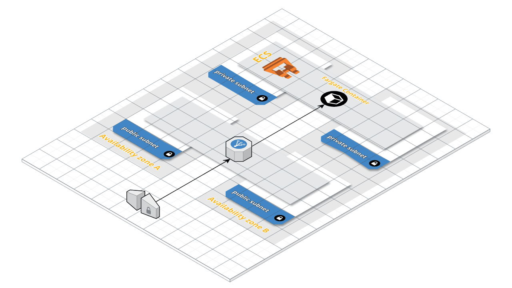
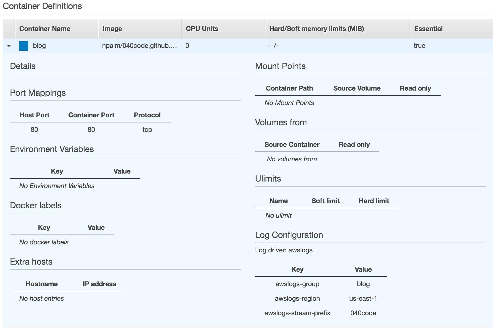
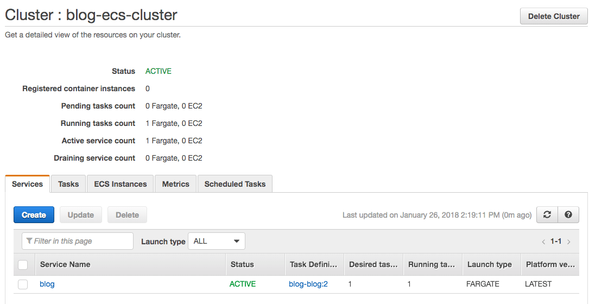

Last December at the AWS re:invent, AWS announced the new container service platform Fargate. Fargate is integrated to ECS. The key difference is that Fargate does not require you to have EC2 instances running to host your containers, which means we have serverless containers. A drawback is that Fargate is not globally available yet, today Fargate is only available in `us-east-1`, see also the [list](https://aws.amazon.com/about-aws/global-infrastructure/regional-product-services/) of supported regions. Later in December Fargate also become available in [Terraform](https://www.terraform.io/) so time to see how it works.

In this post I will show how to deploy containers to Fargate using Terraform. As example docker image I will use the blog itself. The complete example in available on [GitHub](https://github.com/npalm/blog_terraform_aws_fargate). First I show how you can deploy a container using Terraform to Fargate. In case you would like to experiment with AWS console instead of Terraform you should be able to execute the same steps direct in AWS. Only the VPC part could be a bit tricky, but even that part can be skipped and replaced with the default VPC. In that case you don't have private subnets available.

Finally I will discuss how a deployment with Fargate in ECS compares to a deployment with EC2 in ECS. And show what steps have to be taken to move the deployment from Fargate to EC2 instances.


## Prerequisites
Before you start you need to have programmatically access to an AWS account and Terraform (0.11+) installed. The tool [tfenv](http://brewformulas.org/Tfenv) let you manage multiple terraform version on your system.

## Deploy serverless containers on Fargate
Before we can create our containers, we have to create a few infrastructural components. For this example we create an own VPC including public and private subnets. An ECS cluster for our containers, and a CloudWatch log group for centralized logging. The diagram below shows an abstract view of the deployment we are going to create, this view contains two in instead of the 3 availability zones we use.

<a href="#">
    
</a>

We start with defining the VPC, we choose `us-east-1` since Fargate is only available in this region. In the blog post [Coding a VPC in Terraform](/2017/06/18/terraform-aws-vpc/) you find more details about how this VPC module is structured.

```
provider "aws" {
  region  = "us-east-1"
  version = "1.7.1"
}

provider "template" {
  version = "1.0"
}

module "vpc" {
  source  = "npalm/vpc/aws" // https://registry.terraform.io/modules/npalm/vpc/aws
  version = "1.1.0"

  environment = "blog"
  aws_region  = "us-east-1"

  create_private_hosted_zone = "false"

  // us-east-1 is the only region that supports Fargate
  availability_zones = {
    us-east-1 = ["us-east-1a", "us-east-1b", "us-east-1c"]
  }
}

```

Next we define the ECS cluster, and CloudWatch log group. Since we will deploy to Fargate we don't have to attache EC2 instances to our cluster.

```
resource "aws_ecs_cluster" "cluster" {
  name = "blog-ecs-cluster"
}

resource "aws_cloudwatch_log_group" "log_group" {
  name = "blog"
}
```
Now the first part is defined we execute a `terraform apply` and inpect the results.

<asciinema-player src="assets/2018-01-30-fargate_with_terraform/asciinema/fargate-terraform-1.json"
  cols="166" rows="15" autoplay="true" loop="true" speed="1.5">
</asciinema-player>

The next step is to deploy the docker image with the blog. In ECS you deploy a docker container with a task. And your task will be managed by a service. First we create the task definition which contains the container deployment definition as well. Fargate is using [awsvpc as networking mode](https://docs.aws.amazon.com/AmazonECS/latest/developerguide/task-networking.html), in this mode each task definiton gets its own private ip address. This network mode requires a role for the task execution. In case you create your definition through the Amazon console a service linked role will be created for you. We will create this role also via code.
```
data "aws_iam_policy_document" "ecs_tasks_execution_role" {
  statement {
    actions = ["sts:AssumeRole"]

    principals {
      type        = "Service"
      identifiers = ["ecs-tasks.amazonaws.com"]
    }
  }
}

resource "aws_iam_role" "ecs_tasks_execution_role" {
  name               = "blog-ecs-task-execution-role"
  assume_role_policy = "${data.aws_iam_policy_document.ecs_tasks_execution_role.json}"
}

resource "aws_iam_role_policy_attachment" "ecs_tasks_execution_role" {
  role       = "${aws_iam_role.ecs_tasks_execution_role.name}"
  policy_arn = "arn:aws:iam::aws:policy/service-role/AmazonECSTaskExecutionRolePolicy"
}

```

We have defined the execution rol for the task, next we define the task definion. This task definition consist of two parts. First we define a container definition via a `template_file`. In this container definition you see container port 80 is mapped to host port 80, the task will get its own private IP. And after that we define the task definition self. The following settings are required for a task that will run in Fargate: requires_compatibilities, network_mode, cpu and memory.

```
data "template_file" "blog" {
  template = <<EOF
  [
    {
      "essential": true,
      "image": "npalm/040code.github.io:latest",
      "name": "blog",
      "portMappings": [
        {
          "hostPort": 80,
          "protocol": "tcp",
          "containerPort": 80
        }
      ],
      "logConfiguration": {
        "logDriver": "awslogs",
        "options": {
          "awslogs-group": "blog",
          "awslogs-region": "us-east-1",
          "awslogs-stream-prefix": "040code"
        }
      }
    }
  ]

  EOF
}

resource "aws_ecs_task_definition" "task" {
  family                   = "blog-blog"
  container_definitions    = "${data.template_file.blog.rendered}"
  network_mode             = "awsvpc"
  cpu                      = "256"
  memory                   = "512"
  requires_compatibilities = ["FARGATE"]
  execution_role_arn       = "${aws_iam_role.ecs_tasks_execution_role.arn}"
}
```
Time to verify the code is working by executing a `terraform apply`

<asciinema-player src="assets/2018-01-30-fargate_with_terraform/asciinema/fargate-terraform-2.json"
  cols="166" rows="15" autoplay="true" loop="true" speed="1.0">
</asciinema-player>

<a href="#">
    
</a>

We have still nothing running but you can already see the different parts in de AWS console. We have now a VPC, CloudWatch log group, ECS cluster and task definition available. The next logical step in de AWS console would be to create the service, and find out at the latest step that you need to create a load balancer first. So in code we will define the load balancer first. The load balancer will route traffic via HTTP to the container.

```
resource "aws_security_group" "alb_sg" {
  name   = "blog-blog-alb-sg"
  vpc_id = "${module.vpc.vpc_id}"

  ingress {
    protocol    = "tcp"
    from_port   = 80
    to_port     = 80
    cidr_blocks = ["0.0.0.0/0"]
  }

  egress {
    from_port = 0
    to_port   = 0
    protocol  = "-1"

    cidr_blocks = ["0.0.0.0/0"]
  }
}

resource "aws_alb" "main" {
  internal        = "false"
  subnets         = ["${module.vpc.public_subnets}"]
  security_groups = ["${aws_security_group.alb_sg.id}"]
}

resource "aws_alb_listener" "main" {
  load_balancer_arn = "${aws_alb.main.id}"
  port              = 80
  protocol          = "HTTP"

  default_action {
    target_group_arn = "${aws_alb_target_group.main.id}"
    type             = "forward"
  }
}

```

We connect a target group to the load balancer. The same target group will be used later in the service, the service can register itself to the target group with the actual IP address once up and running. For the target group we have to specify the target type `ip` and not `instance` since containers running in Fargate will get their own IP. Actually this not Fargate but `awsvpc` behavior.

```
resource "aws_alb_target_group" "main" {
  port        = "80"
  protocol    = "HTTP"
  vpc_id      = "${module.vpc.vpc_id}"
  target_type = "ip"
}

output "blog_url" {
  value = "http://${aws_alb.main.dns_name}"
}

```
Again we verify our new code by executing a `terraform apply`.

<asciinema-player src="assets/2018-01-30-fargate_with_terraform/asciinema/fargate-terraform-3.json"
  cols="166" rows="15" autoplay="true" loop="true" speed="1.5">
</asciinema-player>


We are almost there, next we define the service. A task running in in network mode `awsvpc`, requires a service that defines a network configuration. In the networking configuration we define a security group to control access to our containers, and we define the subnets in which the containers are hosted.

```
resource "aws_security_group" "awsvpc_sg" {
  name   = "blog-awsvpc-cluster-sg"
  vpc_id = "${module.vpc.vpc_id}"

  ingress {
    protocol  = "tcp"
    from_port = 0
    to_port   = 65535

    cidr_blocks = [
      "${module.vpc.vpc_cidr}",
    ]
  }

  egress {
    from_port   = 0
    to_port     = 65535
    protocol    = "tcp"
    cidr_blocks = ["0.0.0.0/0"]
  }

  tags {
    Name        = "blog-ecs-cluster-sg"
    Environment = "blog"
  }
}
```
The last resource to create is the service. In the service we connect the task, load balancer and security group together. By setting the launch type to `FARGATE` we tell Amazon to deploy the container to Fargate.

```

resource "aws_ecs_service" "service" {
  name            = "blog"
  cluster         = "${aws_ecs_cluster.cluster.id}"
  task_definition = "${aws_ecs_task_definition.task.arn}"
  desired_count   = 1

  load_balancer = {
    target_group_arn = "${aws_alb_target_group.main.arn}"
    container_name   = "blog"
    container_port   = 80
  }

  launch_type = "FARGATE"

  network_configuration {
    security_groups = ["${aws_security_group.awsvpc_sg.id}"]
    subnets         = ["${module.vpc.private_subnets}"]
  }

  depends_on = ["aws_alb_listener.main"]
}
```
That is the last part of coding, run `terraform apply` and inspect the result.

<asciinema-player src="assets/2018-01-30-fargate_with_terraform/asciinema/fargate-terraform-4.json"
  cols="166" rows="15" autoplay="true" loop="true" speed="1.5">
</asciinema-player>

That is all, we have now our blog running as serverless container in AWS Fargate.

<a href="#">
    
</a>


## Mixing EC2 and Fargate on ECS
Great we have now our container running in ECS with Fargate but what if we would like to move the container to a dedicated EC2 instances in ECS. Or what if we need that are not available in in Fargate, such as a volume mount? How difficult would it be to move our containers to an ECS cluster with dedicated EC2 instances? Time to do an experiment to see how difficult is is.

First we refactor the above code to some [generic ecs service modules](https://github.com/npalm/terraform-aws-ecs-service) to be able to define our services with just a few lines of code. This module replaces all code of defining the load balancer, service and task. It still requires a VPC, ECS cluster, CloudWatch logging group, awsvpc security group and execution role. In the code you see a similar deployment of the blog but now with a generic ECS service module.

```
locals {
  fg_container_name = "blog"
  fg_container_port = "80"
}

data "template_file" "blog" {
  template = "${file("${path.root}/task-definition/blog.json")}"

  vars {
    container_name   = "${local.fg_container_name}"
    container_port   = "${local.fg_container_port}"
    log_group_name   = "${aws_cloudwatch_log_group.log_group.name}"
    log_group_region = "${var.aws_region}"
    log_group_prefix = "blog"
  }
}

module "blog-fg" {
  source = "npalm/ecs-service/aws" // https://registry.terraform.io/modules/npalm/ecs-service/aws

  service_launch_type  = "FARGATE"
  service_name          = "${local.fg_container_name}"

  vpc_id       = "${module.vpc.vpc_id}"
  vpc_cidr     = "${module.vpc.vpc_cidr}"
  lb_subnetids = "${module.vpc.public_subnets}"
  ecs_cluster_id = "${aws_ecs_cluster.cluster.id}"
  lb_internal = false

  task_definition = "${data.template_file.blog.rendered}"
  task_cpu        = "256"
  task_memory     = "512"

  awsvpc_task_execution_role_arn = "${aws_iam_role.ecs_tasks_execution_role.arn}"
  awsvpc_service_security_groups = ["${aws_security_group.awsvpc_sg.id}"]
  awsvpc_service_subnetids       = "${module.vpc.private_subnets}"

  lb_target_group = {
    container_name = "${local.fg_container_name}"
    container_port = "${local.fg_container_port}"
  }

  lb_listener = {
    port     = 80
    protocol = "HTTP"
  }
}
```

We still have our container not running in ECS on EC2 instances. For that we first have to create EC2 instances that will be attached to the same ECS cluster. For more details about create the EC2 instances see the [ecs instance repo](https://github.com/npalm/terraform-aws-ecs-instances) on GitHub.

```
locals {
  key_name = "blog"
  environment = "dev"
}

resource "aws_key_pair" "key" {
  key_name   = "${local.key_name}"
  public_key = "${file("id_rsa")}"
}

module "ecs_instances" {
  source  = "npalm/ecs-instances/aws" // https://registry.terraform.io/modules/npalm/ecs-instances/aws

  ecs_cluster_name = "${aws_ecs_cluster.cluster.name}"
  aws_region       = "${local.aws_region}"
  environment      = "${local.environment}"
  key_name         = "${local.key_name}"
  vpc_id           = "${module.vpc.vpc_id}"
  vpc_cidr         = "${module.vpc.vpc_cidr}"
  subnets          = "${module.vpc.private_subnets}"
}
```

Now we have our EC2 instances available we only have to copy the the blog module above and change the launch type to `EC2`, and our container will be deployed to a dedicated EC2 instance.

```

module "blog-ec" {
  source = "npalm/ecs-service/aws" // https://registry.terraform.io/modules/npalm/ecs-service/aws

  service_launch_type  = "FARGATE"
  service_name          = "blog-ec2"

  ... SAME AS ABOVE ...
}
```

That is all, all sample code is available at [GitHub](https://github.com/npalm/blog_terraform_aws_fargate) see subdir `fargate-ec2`. Time to run a `terraform apply` to see if it works.

<asciinema-player src="assets/2018-01-30-fargate_with_terraform/asciinema/fargate-ec2.json"
  cols="166" rows="15" autoplay="true" loop="true" speed="1.5">
</asciinema-player>

In the output you will find the two endpoint links to the blogs. After a few minutes both links will be active. You can also see the service running on the Amazon console, simply navigate to the ECS console and select the cluster. You should see now one service on Fargate and the second one on EC2.

<a href="#">
    
</a>
