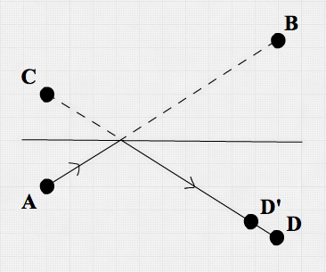
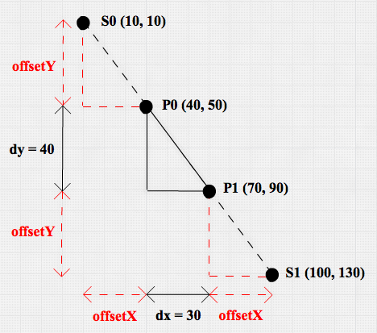

## Introduction

In this post we're going to dive into physics simulation with Clojure. The
ideas in this post were mostly inspired by [this paper by Thomas
Jakobsen](http://graphics.cs.cmu.edu/nsp/course/15-869/2006/papers/jakobsen.htm).

My motivations for working on this toy project were:

- Experimenting with a very mutable domain in a language with immutability at
  its core
- Having some fun by making a lot happen on screen without writing lots of code
- Coding using emacs & [CIDER](https://github.com/clojure-emacs/cider) (The
  `C`lojure `I`nteractive `D`evelopment `E`nvironment that `R`ocks)

The source code can be found [here](https://github.com/mmzsource/verlet).
The result:

<iframe src="https://player.vimeo.com/video/258632942" width="640" height="732" frameborder="0" webkitallowfullscreen mozallowfullscreen allowfullscreen></iframe>


## One `main-` to bind them all

This code uses the [Quil library](https://github.com/quil/quil) to render points
and lines. In the `main-` function, the `sketch` macro from the Quil library is
used to bind the physics domain to the UI.

```Clojure
(defn -main []
  (quil/sketch
    :host           -main
    :title          "Verlet Integration"
    :size           [width height]
    :setup          setup
    :update         update-state
    :draw           draw
    :key-pressed    key-pressed
    :mouse-pressed  mouse-pressed
    :mouse-dragged  mouse-dragged
    :mouse-released mouse-released
    :features       [:exit-on-close]
    :middleware     [quil-mw/fun-mode]))
```

The sketch macro basically asks the developer to configure which 'handler
functions' it should call when certain events occur. For instance:

- a key is pressed -> call `key-pressed`
- the mouse is pressed -> call `mouse-pressed`
- the state of your program has to be updated -> call `update-state`
- it's time to draw the new state -> call `draw`
- etc.

Because I configured Quil to run in functional mode `(quil-mw/fun-mode)`, Quil:

- Uses the return value from the `:setup` function as the initial `state`
- Passes the `state` to each handler function to update it
- Additionally passes a keyboard- and mouse `event` argument to keyboard - and
  mouse handler functions.

The handler function signatures therefore look like this:

```Clojure
(defn draw          [state]       ...)
(defn update-state  [state]       ...)
(defn key-pressed   [state event] ...)
(defn mouse-pressed [state event] ...)
```

## World state

What does a snapshot of this world state look like? `key-pressed` gives some
hints:

```Clojure
(defn key-pressed
  [state event]
  (let [raw-key   (:raw-key event)
        new-state (cond
                   (= \b raw-key) (load-world (load-a-file "blocks.edn"))
                   (= \c raw-key) (load-world (load-a-file "cloth.edn"))
                   (= \p raw-key) (load-world (load-a-file "points.edn"))
                   (= \s raw-key) (load-world (load-a-file "sticks.edn"))
                   (= \i raw-key) (show-info-message)
                   (= \q raw-key) (quil/exit)
                   :else state)]
    new-state))
```

So on pressing a key, a certain world is loaded. Let's look into the 'sticks'
world:

```Clojure
{:points {:p0 {:x  10 :y   1 :oldx   0 :oldy   0}
          :p1 {:x 100 :y 100 :oldx 100 :oldy 100}
          :p2 {:x   0 :y 500 :oldx   0 :oldy 525}
          :p3 {:x  25 :y 475 :oldx   0 :oldy 525}
          :p4 {:x 250 :y 200 :oldx 250 :oldy 200 :pinned true}
          :p5 {:x 350 :y 100 :oldx 350 :oldy 100}}
 :sticks [{:links  [:p0 :p1] :length 138}
          {:links  [:p2 :p3] :length  40}
          {:links  [:p4 :p5] :length 140}]}
```

Nothing special here. Just a map containing `:points` and `:sticks`. We'll dive
into the particulars of points and sticks soon.

## Physics Simulation

This physics simulation deals with Points, and Sticks connecting Points. The
Points are the things that seem to have direction and speed, are influenced by
gravity and lose speed because of friction or because of bouncing against world
borders. The Sticks try to keep their 2 Points apart according to the configured
Stick length. The simulation loop boils down to:

- Update Points
- Apply Stick constraints
- Apply world constraints

In code:

```Clojure
(defn update-state
  [state]
  (->> state
       (update-points)
       (apply-stick-constraints)
       (apply-world-constraints)))
```

This code can be read like this: 'with `state`, first `update-points`, then
`apply-stick-constraints`, and finally `apply-world-constrains`'.

### Points

Points are the main abstraction in this code. I decided to use a record to name
them:

```Clojure
(defrecord Point [x y oldx oldy pinned])
```

A Point stores its current coordinates and the coordinates it had in the
previous world state. On top of that it has a `pinned` property which indicates
if a Point is pinned in space and - as a result - stays on the same coordinate.
A pinned Point can be unpinned by clicking it with the mouse pointer.

The `update-point` function calculates the velocity of the Point and adds some
gravity in the mix:

```Clojure
(defn update-point
  [{:keys [x y oldx oldy pinned] :as point}]
  (if pinned
    point
    (let [vx (velocity x oldx)
          vy (velocity y oldy)]
      (->Point (+ x vx) (+ y vy gravity) x y pinned))))
```

Reading superficially, this code says: if the Point is pinned then return the
same Point. Otherwise, calculate it's velocity (based on the current - and
previous x & y coordinates), add some gravity in the y direction and return the
newly calculated Point.

The function uses
[destructuring](https://gist.github.com/john2x/e1dca953548bfdfb9844) to name all
the arguments of the incoming Point. With destructuring, you can bind the
values in a data structure without explicitly querying the data structure. So
instead of getting each and every value out of Point and binding it to a 'new'
name...

```Clojure
(let [x      (:x      point)
      y      (:y      point)
      oldx   (:oldx   point)
      oldy   (:oldy   point)
      pinned (:pinned point)]
  ...)
```

... you can very effectively tell the function that it will receive a map `{}`
with keys `x y oldx oldy pinned` and that this function should have those
variables available under the same name:

```clojure
[{:keys [x y oldx oldy pinned] :as point}]
```

The code in my repository has some additional type hints, because I wanted the
simulation to run smooth on my laptop and wanted to learn a bit more about type
hinting and compiler optimizations.

And that's it with regard to Points. In a couple of lines of code Points are
already moving and reacting to gravity in the simulation.

### World constraints

It's time for Points to meet the harsh reality of life. Walls are harder than
Points and therefore Points should bounce off of them:

```Clojure
(defn hit-floor?       [y] (> y height))
(defn hit-ceiling?     [y] (< y 0))
(defn hit-left-wall?   [x] (< x 0))
(defn hit-right-wall?  [x] (> x width))


(defn apply-world-constraint
  [{:keys [x y oldx oldy pinned] :as point}]
  (let [vxb (* (velocity x oldx) bounce)
        vyb (* (velocity y oldy) bounce)]
    (cond
      (hit-ceiling?    y) (let [miry (- oldy)]
                             (->Point (+ oldx vxb) (+ miry (- vyb)) oldx miry pinned))
      (hit-floor?      y) (let [miry (+ height height (- oldy))]
                             (->Point  (+ oldx vxb) (- miry vyb) oldx miry pinned))
      (hit-left-wall?  x) (let [mirx (- oldx)]
                             (->Point (+ mirx (- vxb)) (+ oldy vyb) mirx oldy pinned))
      (hit-right-wall? x) (let [mirx (+ width width (- oldx))]
                             (->Point (- mirx vxb) (+ oldy vyb) mirx oldy pinned))
      ;; else: free movement
      :else point)))
```

To explain what happens here, a picture might help.

<a href="#">
    
</a>

Imagine a Point moved from A to B in the last Point update. This means a Point
record is persisted with its `x` and `y` being the coordinates of B and `oldx`
and `oldy` being the coordinates of A. If a wall line crossed the imaginary line
A-B, the Point history should be rewritten. In essence, line A-B is mirrored in
the wall it hits, giving rise to another imaginary line C-D where C mirrors A
and D mirrors B. The `miry` (mirror-y) and `mirx` (mirror-x) variables in the
code contain C coordinates mirroring A coordinates.

The simulation will take a little velocity loss into account when bouncing at
walls. Therefore, D' is calculated by using the x and y velocities (vx and vy)
multiplied by a bounce factor (leading to the `vxb` and `vyb` variables in the
code).

When the world state is drawn, the Point will fly off in exactly the right
direction. Additionally, because of the history rewrite, subsequent Point
updates will keep moving the Point in the right direction.

The picture shows the situation when hitting the ceiling. Hitting the floor and
the walls works similar. And that's all the math and code you need to simulate
Points moving in a bounded space. Now let's add Sticks to the simulation.

### Stick constraints

Not only walls are restricting Points from free movement; Sticks also constrain
them. A Stick connects 2 Points and has a configured length. The goal of the
Stick constraint is to move the Points at the end of the Stick to the configured
length of the Stick.

<a href="#">
    
</a>

Instead of trying to calculate the solution that satisfies all Stick constraints
at once, this code simply looks at one Stick at a time and 'solves' the
constraint problem by repeatedly solving Stick constraints in isolation.

```Clojure
(defn apply-stick-constraint
  [{length :length :as stick}
   {p0x :x p0y :y oldp0x :oldx oldp0y :oldy pinp0 :pinned :as p0}
   {p1x :x p1y :y oldp1x :oldx oldp1y :oldy pinp1 :pinned :as p1}]
  (let [{:keys [dx dy distance]} (distance-map p0 p1)
        difference (- length distance)
        fraction   (/ (/ difference distance) 2)
        offsetX    (* dx fraction)
        offsetY    (* dy fraction)
        p0-new     (->Point (- p0x offsetX) (- p0y offsetY) oldp0x oldp0y pinp0)
        p1-new     (->Point (+ p1x offsetX) (+ p1y offsetY) oldp1x oldp1y pinp1)]
    [(if pinp0 p0 p0-new) (if pinp1 p1 p1-new)]))
```

`apply-stick-constraint` takes a Stick and 2 Points (P0 and P1) as arguments.
These arguments are heavily destructured. To understand what happens precisely,
the next picture might be helpful:

<a href="#">
    
</a>

Let P0 and P1 be two Points with a Stick S between them. P0 and P1 have already
been updated by the `update-point` function and their new (x,y) coordinates are
(40,50) and (70,90) respectively. This means:

- dx = 30
- dy = 40
- distance = 50

Since the Stick between P0 and P1 was configured to have a `length` of 150, and
we want P0 and P1 to be adjusted by the same amount, P0 _should_ be located at
Point S0 (10,10) and P1 _should_ be located at Point S1 (100,130). This is
exactly what `apply-stick-constraint` achieves:

- The `difference` in the configured `length` of the Stick and the `distance` of P0
  and P1 is 100
- The `fraction` of the `distance` between P0 and P1 that needs to be added to
  P0 AND to P1 is 1. So by extending the `distance` P0 and P1 with exactly 50
  (`distance` times `fraction`) in both directions, we'll solve the Stick
  constraint.
- This is done by using `offsetX` on P0x and P1x and using `offsetY` on P0y and
  P1y

Conceptually a scaled helper triangle is used to move P0 and an identical scaled
helper triangle is used to move P1. The scale of this triangle is determined by
the `fraction` which in this case is 1. These triangles are depicted in red.

Each Stick in the world is updated before a new world frame is drawn. It is very
well possible that the neatly placed P0 and P1 are moved to different
coordinates by another Stick constraint before the complete update is over. This
sometimes results in wiggly behavior, although in most cases, the simulation
is perceived to behave naturally.

## Drawing

Finally, the Points and Sticks have to be drawn on screen:

```Clojure
(defn draw
  [state]
  (quil/background 255)
  (if (:info-message state)
    (quil/text info-message 20 20)
    (do
      (doseq [point (vals (:points state))]
        (quil/ellipse (:x point) (:y point) 7 7))
      (doseq [stick (:sticks state)]
        (let [points (:points state)
              p0     ((first (:links stick)) points)
              p1     ((last  (:links stick)) points)]
          (quil/line (:x p0) (:y p0) (:x p1) (:y p1)))))))
```

Start by clearing the screen. If there is an `:info-message` entry in the
`state`, draw the `info-message`. Otherwise draw all Points in `state` as a
quil/ellipse and draw all Sticks as a quil/line. And that's all folks!

## Conclusion

As always, it was a pleasure working with Clojure. It turns out to be easy to
work in a very mutable domain with mostly pure functions, also thanks to the
excellent Quil library.

My current version of [cloc](https://github.com/AlDanial/cloc) tells me that
core.clj is 230 lines long, but it counts the function documentation as code.
Therefore, I ran a new `cloc` command without the doc strings. It then counts
159 lines of clojure, approximately half of which are dedicated to UI
interaction and the other half to physics simulation. Not bad at all!

I'm glad I decided to 'bite the bullet' and learn Emacs and CIDER. I now use
Emacs for all my Clojure(script) development. In addition, I use Emacs for most
of my text editing these days including writing and planning.

I'd like to thank Michiel Borkent a.k.a.
[@borkdude](https://twitter.com/borkdude) for reviewing an earlier version of
the code and giving me very helpful feedback. Faults and not-so-idiomatic
Clojure code remaining are my own.

Please share your comments, suggestions and thoughts about this blog post on
[twitter.com/mmz_](https://twitter.com/mmz_). Thanks for reading and Happy
Coding!

## Links

- [Verlet integration
  paper](http://graphics.cs.cmu.edu/nsp/course/15-869/2006/papers/jakobsen.htm)
- [My verlet integration code in clojure](https://github.com/mmzsource/verlet)
- [Quil library](https://github.com/quil/quil)
- [Emacs CIDER plugin](https://github.com/clojure-emacs/cider)
- [Cloc - counting lines of code](https://github.com/AlDanial/cloc)
