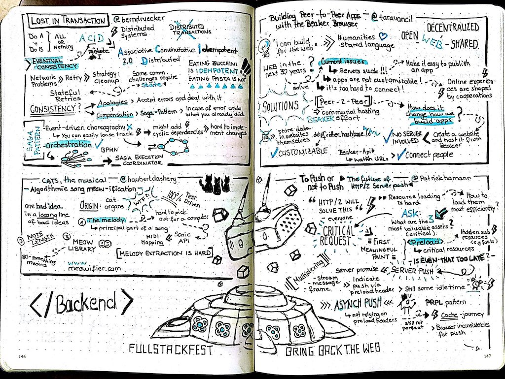
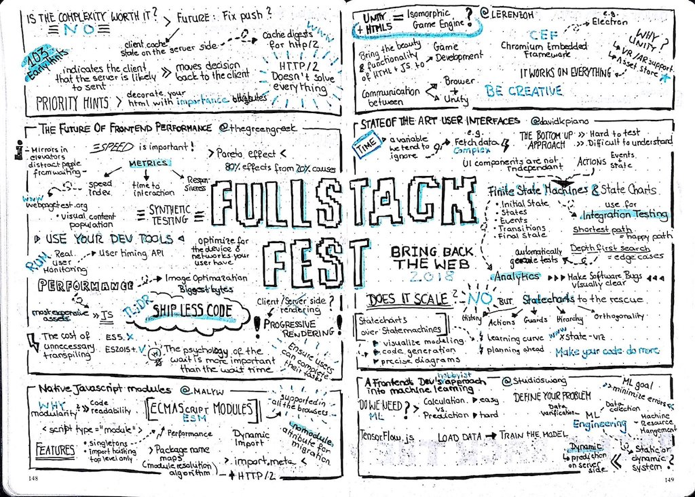

# Full Stack Fest 2018

This week we (Jeroen, Niek, Gertjan, Eric and Kike) are enjoying [Full Stack Fest 2018 Barcelona](https://2018.fullstackfest.com/),
a week-long full stack development conference with a focus on solving current problems with new & inspiring perspectives.

This conference is split up in two parts. The first two days were focussed on Backend development. You can read our post about it [here](https://040code.github.io/2018/09/05/fsf-backend/)

In this quite short blog we just summarizing briefly the talks for the second part, the front-end part. It's  **our opinion** about the talks. We have rated all talks, the rating is subjective as well.

First of all we would like to thank [Reginald Braithwaite](https://twitter.com/raganwald) for hosting the sessions.

## Day one

### Building peer-to-peer apps with the Beaker Browser
rating: :star: :star: :star: :star:

[Tara Vancil](dat://taravancil.com/about/), during the backend days we already are informed about the lack of freedom is our social networks, and how this could be solved with decentralized social networks. Tara showed that the web has the same problem. Do you remember Geocities? Yepz these sites are gone. And deploying or customizing web apps is still hard. Would it not be great we can fix it just in the browser the app we loved the most. Tara showed how easy you can run, customize and deploy a decentralized web app.

### To push, or not to push?! - The future of HTTP/2 server push
rating: :star: :star: :star: :star:

Patrick Hamann [@patrickhamann](https://twitter.com/patrickhamann), resource loading is still hard, performance in the browser is tightly coupled to latency, connection costs are high, and scipt execution is expensive. Patrick explained how to use resources wisely, make a difference between critical resources. resources in the users viewport, and non critical resources. By using preload, push and async push together with a strategy of critical resource a hugh step can be made for a high performing web app. See the slides [here](https://noti.st/patrickhamann/9GvEed/to-push-or-not-to-push)

### The Future of Front-End Performance
rating: :star: :star: :star: :star:

[Sia Karamalegos](https://twitter.com/thegreengreek), a great talk on performance of the front-end. How much impact does it has on your business. Staggering numbers were shown about AliExpress load time reducing and how that correlates to an increase conversion for new customers.
Apps become bigger and bigger. Make sure you check your apps on size / speed by using tools like [webpagetest.org](https://webpagetest.org). Optimize your images. Most of the web are images, but the most expensive bytes are javascript. Prioritize the code your shipping.
[Slides](https://speakerdeck.com/siakaramalegos/the-future-of-front-end-performance) and [more info](https://github.com/siakaramalegos/sia_speaks) are available.

### Native JavaScript modules- import {Browsers, NodeJs}; export {production};
rating: :star: :star: :star: :star:

[Serg Hospodarets](https://twitter.com/malyw), great news for modern JavaScript development. Most browsers now support Native JavaScript modules ESM. This will change our way we are bundling our JavaScript using Webpack, Rollup and other bundlers. It's also available in node and the extensions is called Micheal Jackson Solution aka .mjs
Dynamically loading javascript modules in combination with HTTP/2 can save a lot of load time.
[Simular slides](https://slides.com/malyw/native-js-modules)

### Unity + HTML5 = Isomorphic Game Engine?
rating: :star: :star: :star: :star:

Lerenzo Malcom [@lerenzom](https://twitter.com/lerenzom), showed how to combine the world of Unity and the browser. Last year A-Frame was a big topic that address the same solution space but Lerenzo showed how to combine Unity in the browser instead of A-Frame. After discussing why unity and not A-Fram he spend attention how to setup bi-directional messaging, and finally gives some WebGL examples. Sorry we are not that AR/VR boys but with this talk Lerenzo did an awesome job, please see the slides (including animations) [here](https://docs.google.com/presentation/d/1LTNFqURDAeDYZTD3cjpZ3XMQoD8rDNm1Z4LEDuKo64o/edit)

### State of the Art Web User Interfaces with State Machines
rating: :star: :star: :star: :star: :star:

David Khourshid ([@davidkpiano](https://twitter.com/davidkpiano)), the front end is complex, it is difficult to understand, difficult to read, contain bugs, hard to enhance and new features make it even worse. What if we model our front end as an finite state machine (FSM). Nothing new in Computer Science, states machines are already introduces in “automata theory”, Specifying a the front end action (flow) in a state machine increase the predictability and even make it possible to automate testing. Just calculate you the shortest path via Dijkstra algorithm. David showed his open source framework xstate which is available on [GitHub](https://github.com/davidkpiano/xstate#readme) and [npm](https://www.npmjs.com/package/xstate). Slides are are [here](https://slides.com/davidkhourshid/statecharts-fsf) available

### A Front-end dev's hobbyist approach into Machine Learning
[Susanna Wong](https://twitter.com/studioswong), machine Learning is hard. It's almost impossible to explain this in just one talk. Especially when you combine it with all kind of background information. We were very impressed by the architecture of the buildings, but unfortunately the talk was too much out of our reach.

### Building a Modern Memex
rating: :star: :star: :star: :star: :star:

Andrew Louis [@hyfen](https://twitter.com/hyfen), Imagine you can manage all your data with a single device.... An idea that goes back to the 1945 when Vanneva Bush discribed the [Memex](https://en.wikipedia.org/wiki/Memex). Andrew build his own Memex and demo the awesome combination fo all the data he collected over the years. Absolutely crazy to see that he is able to search back in time which podcast he was listing when driving from A to B. To be able to combine all your data from Google, Spotifiy, Maps, Whatsapp and so on, probably you need a complex system. But Andrew handles it all just with Rails, Ember, Electron, Node and Postgres. And how cool it is all [open source](https://hyfen.net/memex/). [Slides](https://speakerdeck.com/hyfen/building-a-modern-memex) are here.

### Everything in sketchnotes..
A big shoutout to Christin Westermann ([@_c16n_](https://twitter.com/_c16n_)) for creating these sketchnotes!

## Day 2

### Accessibility vs latest Web APIs. Can’t we just get along?
rating: :star: :star:

Mauricio Palma ([@palmaswell](https://twitter.com/palmaswell)) showed pasionated how important it is to make the web accessible for everyone, also for the ones with a disability. For example, he show cased how to use the Google speech API. A quote to remember from Maricio: "If we use our own abilities as a baseline, we make things that are easy for some people to use, but difficult for everyone."

### The Web Authentication API - Imagine a World Without Passwords
rating: :star: :star: :star:

By Suby Raman ([@subyraman](https://twitter.com/@subyraman))

Passwords were invented for a good reason. The world has changed and unfortunately, passwords are not sufficiently secure enough anymore. There are a lot of problems attached to the concept of passwords. The Web Authentication API allows us to authenticate our users using public key cryptography. This prevents malicious users to gain access to your data even if they have the public key. Modern computers have dedicated hardware to perform authentication, like touchID, faceID, camera's, usb-tokens. This can now be used in our webapplications. This is very much in line with what we are want to achieve in our own [project](https://github.com/philips-software/cogito). [Slides](https://bit.ly/suby-fsf)

### Killing the checkout or: How I learned to stop worrying and love Payment Request
rating: :star: :star: :star:

As member of the W3C Web Payments Working Group, Krystian Czesak ([@krystostrerone](https://www.twitter.com/@krystostrerone)), is heavily involved in setting a web standard on Payment Requests. The Response code 402 Payment Required is already there for a long time, but is never implemented. Lots of attempts are made, but none of them succeeded till now.. Currently the checkout procedure on most applications is not so user friendly. The Web Payments is initiated to improve this user experience. All modern browsers support it. All information about you is stored in your browser and not on each page. There's an API available to use that information, so the user only has to add the information once and it can be used in every application. Chrome even supports Interledger. The presentation has a lot of information how to implement a client for this. See the slides for more info. [Slides](https://speakerdeck.com/krystosterone/killing-the-checkout-or-how-i-learned-to-stop-worrying-and-love-payment-request)

### A Real World PWA
Rating: :star: :star: :star: :star:

Zack Argyle, [@ZackArgyle](https://twitter.com/ZackArgyle) stared with the story of Pinterest and what will happen with your uses once you decide to make a blocking page and only support a app. Smoothly continuing with the story how important it is to have a reactive app and what that means. A progressive web app is according to Zack: "A site that utilizes progressive enhancements, meaning that modern browsers will get a better experience than older browsers". He explained how he used the principle of the 3R's to build a progressive app. By Reduce, make it light. Use for example [the webpack analyzer](https://www.npmjs.com/package/webpack-bundle-analyzer). Reuse, caching, server workers. Cache via a worker is faster then the browser cache. And Review, measure performance! Slides are available [here](https://speakerdeck.com/zackargyle/a-real-world-pwa)

### Purifying Typescript
rating: :star: :star: :star: :star:

Timothy Clifford, [@timothyclifford](https://twitter.com/timothyclifford). Cool to see that we can do functional programming with JavaScript a language written in 10 days back in 1995 an nowadays the most populair language. We really liked the talk and clear examples how to program functional with TypeScript in JavaScript. Maybe the talk was little to much basic introduction to functional programming, but Timothy succeeds in his mission statement: "Understand how to apply functional programming techniques with TypeScript". [Slides](https://github.com/timothyclifford/purifying-typescript/raw/master/Functional%20Typescript%20-%20Tim%20Clifford.pdf) and [code](https://github.com/timothyclifford/purifying-typescript) are shared via GitHub.

### Dynamic CSS: Layouts & Beyond
rating: :star: :star: :star: :star:

This talk by -Tara Vancil-, I mean Miriam Suzanne ([@mirisuzanne](https://twitter.com/mirisuzanne)), was really fantastic. She integrated lots of photos from previous talks on the same day. But not only that was remarkable. The knowledge on CSS is outstanding. She showed us the history of how we used to do CSS, from tables to SASS, to flexbox and Houdini. But all of these methods needed some wicked tricks to work in some cases. Now there is something new and this is promising. CSS Grid. This is the future of layouts, so take a look at this. In the slides you will see several examples of how to use it. F.e. [https://gridbyexample.com/](https://gridbyexample.com/) and the the  [Slides](http://talks.oddbird.net/dynamic-css/fullstack18/).

### Lightning talks

1
first one: @EleanorClarinet
Nice corrolation between learning music and learning to code.
Don't be a "Mozart pianist", be a musician
Don't be a "React developer", be an engineer

[Slides](https://docs.google.com/presentation/d/1Al7AUbzCwFW7qxi69DiWcpxbcKQOV29uxUDrbnhJD6c)

2
Isac. Rocket fuel for Ember.js and javascript teams.
Splanky about jazz shows in Smalls NYC.

3
2013 it was already possible to do a lot of reactive stuff with imba.io

4
Robert Nickel about Mob Programming.
We love Mob Programming, but it's hard. See [slides](https://docs.google.com/presentation/d/1HwfNfWzRSPMSIrTi41yRaRPme3xdI6dD18vwxi2kfJo/edit#slide=id.g40d1a107b1_0_138)

5
Andreaverlicchie.eu
Better navigation in markup

6
Berkay --> Sharing
How to share components between multiple react projects

### WebXR, if X = how?
rating: :star: :star:

[Diego González](https://twitter.com/diekus) and Indira Knight introduced Extended reality, XR or should we say AR + VR in the browser. Physical and virtual worlds are merging, XR is coming to the browser, and the browser is coming to XR devices. The frameworks ((A-Frame && ThreeJS) \|\| BabylonJS) && WebGl where demoed in the browser, both in a 2d and 3d view. For more details see the [slides](https://www.slideshare.net/DiegoGonzlezZiga/webxr-if-x-how) for more references.

## Thanks to Codegram

We would like to conclude our post with a big applause for [codegram](https://www.codegram.com/), the Full Stack Fest was awesome again. Please never change the single track philosophy. And did we already mentioned the food is the best we ever had on a conference.

    <iframe  style="position:absolute; left:0; top:0; width:100%; height:100%" src="https://www.youtube.com/embed/YIRvXmJyRxQ?list=PLe9psSNJBf75O6abYvvjxhm36_QU9H-f2?rel=0"     
      frameborder="0" allow="encrypted-media" allowfullscreen></iframe>

