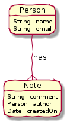
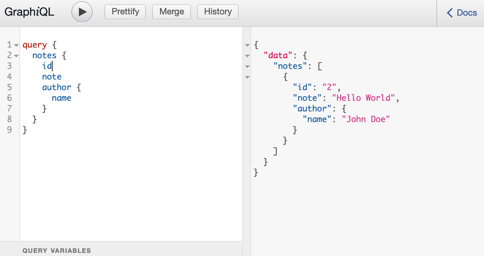
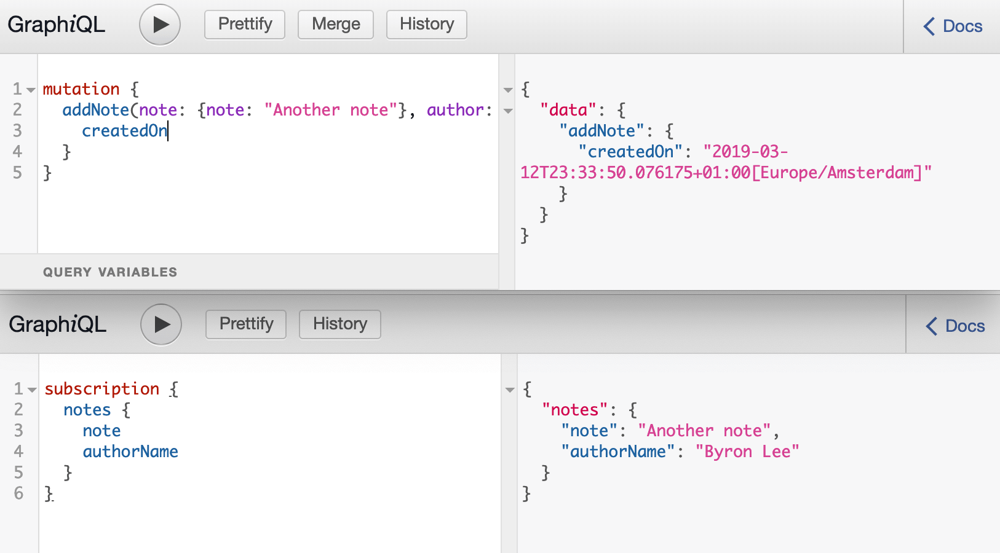

### Introduction
Now GraphQL is not anymore that new kid on a block it would be nice if we can implement a service with a GraphQL interface. Spring Boot is one of the well known frameworks to build your micro services in Java. Time to assess how easy, or hard it will be to implement a GraphQL service. In this post we will not explain how [GraphQL](https://graphql.org/) works. We focus on a simple Java Spring Boot micro services with a JPA layer. In the GraphQL language we cover the tree major concepts, a query, a mutation and a subscription.

GraphQL is API is based on three main concepts. Query the backend for data using a graph based query. The query is in a JSON like style and the response is valid JSON. A major difference with REST is that wit a query you can specify excatly what you expect or want from the backend. Mutation are the way to change data in the system based on flat input object. In this example we use mutation to add new information. Finally we have subscription to subscribe for changes and get notified once something is changed via a web socket.

### Java, Spring and GraphQL.
For implementing a GraphQL service you have two choices. Either schema first, or code first. So similar concepts as we used with SOA XML services. When starting with code you have to write more plumbing code, but you have more freedom. And on the other side starting of the schema reduce all the plumbing code and gives a faster start.

In this blog we first create a simple JPA enabled Spring Boot service. Then we add step-by-step GraphQL features to the service. We start from the schema and show which small additions you have to do to our application. Starting from a schema will not result in generated coded, you still have to write the matching code yourself. For the Java implementation we will use the libraries from [graphql-java-kickstart](https://github.com/graphql-java-kickstart).


### Sample Model and API
For simplicity we use in this blog a simple domain model. Consisting of two classes. A person and notes, a person can have multiple notes. And a note always has one author, a person.

<a href="#">
    
</a>

### Create a simple Note Service
First we create a simple Spring JPA services, to store the Notes and the Authors of type Person. The implementation will be straightforward. We create an entity class for Person and Note. Fore readability the imports and other plumbing is omitted. See [GitHub](https://github.com/npalm/blog-graphql-spring-service) for a complete implementation.


```java
@Entity
public class Person {
    @Id @GeneratedValue
    private final Long id = null;

    @Column(unique = true)
    private String name;

    private String email;
}
```
```java
@Entity
public class Note {
    @Id @GeneratedValue
    private final Long id = null;

    private String note;

    private ZonedDateTime createdOn;

    @ManyToOne(fetch = FetchType.EAGER)
    private Person author;
}
```

Next we define two spring JPA repositories to store the entities above in our database.

```java
@Repository
public interface PersonRepository extends CrudRepository<Person, Long> {

    List<Person> findAll();
}

```

```java
@Repository
public interface NoteRepository extends CrudRepository<Note, Long> {

    List<Note> findAll();
}
```

Finally, we define the services interface which we will use to implement the GraphQL queries,

```java

@Service
public interface NotesService {

    public Note save(Note note);

    public Optional<Note> findById(Long id);

    public List<Note> findAll();
}

```

So that is all to create a simple service with basic JPA (persistence) capacity. Time to focus on adding GraphQL to our service.

### Implement a query
As base library we use `graphql-java-tools` this library requires a GraphQL schema to implement GrahpQL. The first step is to define a schema for our queries. The schema defines our GraphQL root, for now only the query. Next the queries we will implement and the types we use. We define two queries. The first one to look op a note and the second one to find all notes based on a filter. Next, we define the types. As you can see a Note has a relation to a Person object. By querying for a note we can get immediately the authors name for example.

```
schema {
    query: Query,
}

type Query {
    note(id: Long!): Note
    notes: [Note]
}

# Object to represent a note
type Note {
    id: ID!
    note: String
    createdOn : String
    author: Person
}

# Object to represent a note
type Person {
    id: ID!
    name: String
    email: String
}


```

### Implement Mutation
We have now defined a first version of a GraphQL schema. The second step is to connect the schema to the Note Service. GraphQL java tools expects for each query, a resolver function. Therefore, we need to implement `GraphQLQueryResolver` from graphql-tools.


```java
@Component
public class Query implements GraphQLQueryResolver {

    private NotesService notesService;

    public Query(NotesService notesService) {
        this.notesService = notesService;
    }

    public Optional<Note> note(final Long id) {
        return notesService.findById(id);
    }

    public List<Note> notes() {
        return notesService.findAll();
    }
}
```

This is all, we have to do to be able to handle the queries as specified in the schema. We can now start the spring boot application and open http://locahost:8080/graphiql and query form some. Graphiql is a simple IDE to execute GraphQL queries. A much richer tool to play with your queries is [GraphQL Playground](https://github.com/prisma/graphql-playground). Actually no fun yet, we can only execute queries without getting any result. We simply have an empty system. We need a way to add notes to the system. In GraphQL you mutate data via a mutation. In the next step we add a mutation to the schema and update the code for executing the mutation.

In the schema we add the mutation to the root and add a mutation to add a note to the `Mutation` type. Quite similar to defining the query above. For the input we define an input object for both Note and Person.

```

schema {
    ...
    mutation: Mutation
}

type Mutation {
    addNote(note: InputNote!, author: InputPerson!): Note
}

# Input type for the author of the note
input InputPerson {
    name: String!
    email: String
}

# Input type for a new Note
input InputNote {
    note: String!
}
```

Similar to implementing the query we have to implement an interface and declare methods for the mutation. Mutations have to be implemented in a class implementing the interface GraphQLMutationResolver. In this implementation we defined for the input objects converters to convert the GraphQL input object to domain objects that can be consumed by the service.

```java
@Component
public class Mutation implements GraphQLMutationResolver {

    public Note addNote(final InputNote note, final InputPerson author) {
        return notesService.save(InputNote.convert(note, author));
    }
}

```

Let's test the service. Build and start the service `/gradlew clean bootRun` and open [http://localhost:8080/graphiql](http://localhost:8080/graphiql).

```
mutation {
  addNote(note: {note: "Hello World"},
    author: {name: "John Doe", email: "no-reply@jonn.doe"}) {
    id
  }
}

```

And query for all available notes. This should result only in the note above.

```java
query {
  notes {
    id
    createdOn
    note
    author {
      name
    }
  }
}
```

<a href="#">
    
</a>

Add some more notes and experiment with the query. All standard features will work such as aliases, fragement and variables.


### Implement Subscriptions.

Another cool feature is the subscriptions. With a subscription you can subscribe to updates via a websocket. The same philosophy is followed for the subscription. You will gat your data in same structure as specified in the subscription call.

To add subscription to our Java implements, we update the schema and add code to handle updates. To add a subscription for new notes we update the GraphQL schema first. Again update schema root and add the subscription, define the available subscriptions and add the required types.

```
schema {
    ...
    subscription : Subscription
}

type Subscription {
    # Subscribe to all new comments
    notes: NoteUpdate!
}

type NoteUpdate {
    # The note text
    note : String
    # The name of the author
    authorName : String
    # Time when the note was received
    createdOn : String
}
```

And once again we have to implement a resolver, this time we implement the `GraphQLSubscriptionResolver`.

```java
@Component
class Subscription implements GraphQLSubscriptionResolver {

    private CommentPublisher commentPublisher;

    Subscription(CommentPublisher commentPublisher) {
        this.commentPublisher = commentPublisher;
    }

    Publisher<NoteUpdate> notes() {
        return commentPublisher.getPublisher();
    }
}

```

```java
public Note save(Note note) {
    ...
    notePublisher.publish(savedNoed);
    ...
}
```

The `notePublisher` is responsible to update messages via a WebScoket so the subscribers get the update. For the implementation check out the GitHub repo. Time to test the subscription. An easy way to test is topen the GraphiQL editor on two screens. Invoke in the first one the subscription and in the second one add a note. You will see you get an update of the new note on the first screen.

```
subscription {
  notes {
    note
    authorName
  }
}
```
<a href="#">
    
</a>


### Testing
Another nice feature provided by [graphql-spring-boot](https://github.com/graphql-java-kickstart/graphql-spring-boot) is the test utils. Testing your GraphQL queries becomes really simple. The library provide a `GraphQLTestTemplate` which makes it easy to invoke the GraphQL endpoint by with a query. The result is the JSON object. Let's have a quick look on some code. First define the query in `queries/find-notes.graphql`.


```
query FindNotes {
  notes {
    id
    note
    createdOn
    author {
      name
    }
  }
}
```

Now create a test.

```java
@RunWith(SpringRunner.class)
@SpringBootTest(webEnvironment = SpringBootTest.WebEnvironment.RANDOM_PORT)
public class GraphQLNoteTest extends GraphQLBaseTest {

    @Autowired
    private GraphQLTestTemplate graphQLTestTemplate;

    @Test
    public void findNotes() throws IOException {

        GraphQLResponse findResponse = graphQLTestTemplate.perform("queries/find-notes.graphql", null);
        assertTrue(findResponse.isOk());

        // asserts to check the content
    }
}
```

That is all, of course you should add some assert to check the content as well. For more details check out the [GitHub](https://github.com/npalm/blog-graphql-spring-service) repo of this blog.


### Some thoughts

The example above shows how you can enable your Spring Boot service with a GraphQL API. Adding a GraphQL layer to your existing (simple) service is fairly easy with the tools. But GraphQL will become really powerful when you combine multiple (REST) API in one GraphQL endpoint to create a fluent and understandable API.

If a java based approach is in that case the best way to go, I don't know yet. In that case it could be interesting to dive into [Rejoiner](https://github.com/google/rejoiner).
