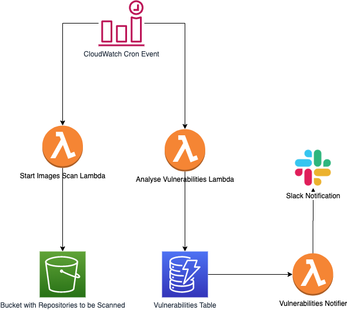
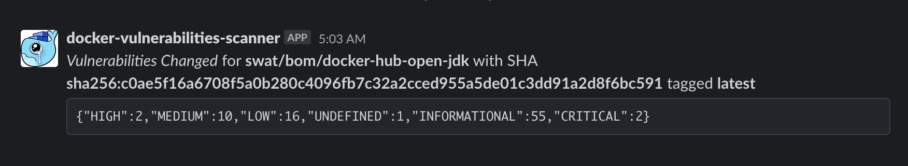
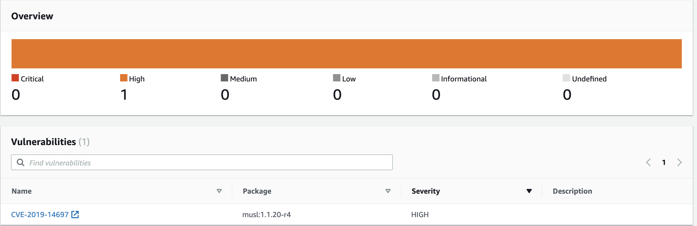

*This post explains how to scan docker images on AWS ECR and get notified when a new vulnerability is found.*

<p style="text-align: right">
  <a href="https://github.com/philips-labs/aws-ecr-scanning-slack-notifications" target="sourcecode">
  <i class="fab fa-github" style="font-size: 200%">&nbsp;</i>Source code for this post</a></p>

## Introduction

On October 2019, AWS released a nice [feature](https://aws.amazon.com/about-aws/whats-new/2019/10/announcing-image-scanning-for-amazon-ecr/) on AWS ECR (Elastic Container Registry). They introduced the ability to scan docker images hosted within ECR in order to detect vulnerabilities.

ECR scanning is free of charge, but you can only scan the same image every 24 hours. You get throttled if you make more than 1 request within 1 day. Naturally, scans are only triggered when an image is pushed. This blog explains how to trigger the scans at your own pace (for example, on a daily basis).

Since we love automation, we have decided to automate scanning task using a full serverless application that sends via slack a notification when there is a change in the scanning results.

## Why?
Docker images are pulled left and right. You find yourself constantly looking for that new image which solves the majority of your problems. You find it. You pull it. You execute it. You like it. You decide to push it to your own ECR Registry because you're afraid the original publisher eventually deletes it from DockerHub, or you simply need a private docker registry. But did you really check what was inside it? Are you aware of all the libraries and packages this image is using? What if there are critical security issues with that image that may compromise the software you're running? What if your company loses tens of thousands (or maybe millions) of dollars just because a vulnerability that was never known?

It may sound scary, and it actually is! Vulnerabilities are everywhere and there's very little you can do to mitigate the problem on your own. Usually, responsible publishers fix these vulnerabilities as soon as they are detected. However, not using a compromised image already is a step in the right direction. Automating this process is even nicer because you can react on it and decide what path to take: whether tailoring your own Docker images or just temporarily suspending the use for a compromised one.

## How?
There are mainly two ways which you can scan your Docker images for vulnerabilities:

1. Enabling _Scan on push_ for a given ECR registry, which will scan every image and output the results within the ECR console.
2. Using the AWS SDK to invoke the APIs in an automated way.

We like #2 because the more automated a process is the better. For example using Terraform:

```
resource "aws_ecr_repository" "my_repo" {
  name                 = "my-image"

  image_scanning_configuration {
    scan_on_push = true
  }
}
```

## Notifying Changes
You don't want to be notified every single time a image was scanned, do you? You only want to be notified when there were vulnerabilities detected for a new image or if the vulnerabilities for a previously scanned image have changed. This means that this state must be stored somewhere. DynamoDB is a great choice here because we can easily store such state there and we can also react to any Table changes using DynamoDB Streams. Do you smell an Event Driven Architecture already?




## Getting our hands dirty

### Scanning images
For our use case, we decided to put all the ECR repositories to be scanned in a `.json` file within an S3 bucket. Everytime the Lambda function runs, it downloads that file, parses it and issues `listImages` for every repository defined and `startImageScan` for every image found.

Using the Node.js SDK and AWS SDK, we can easily put it together, see [github](https://github.com/philips-labs/aws-ecr-scanning-slack-notifications) for the full code.

```javascript
const scan = async () => {
  const s3 = await S3.getObject({
    Bucket: process.env.BUCKET,
    Key: process.env.KEY
  }).promise();
  const repositories = JSON.parse(Buffer.from(s3.Body).toString("utf8"));
  for (const repository of repositories) {
    const images = await ECR.listImages({
      registryId: process.env.REGISTRY_ID,
      repositoryName: repository
    }).promise();
    for (const imageId of images.imageIds) {
        try {
          await ECR.startImageScan({
          registryId: process.env.REGISTRY_ID,
          repositoryName: repository,
          imageId
        }).promise()
      } catch (e) {
        console.log(`Failed scanning image: ${repository}:${imageId.imageTag}`, e)
      }
    }
  }
};
```

This task is as easy as that. It invokes the SDK to start an image scan. This process will now be run asynchronously in AWS.

### Analysing the results for a Scanned image
This could be achieved by reacting to CloudWatch events in AWS, but we decided to go the easy way and periodically poll ECR for the Scan Findings. If something was found, we store the findings in DynamoDB.

```javascript

const analyse = async () => {
  for (const repository of repositories) {
    const images = await ECR.listImages({
      registryId: process.env.REGISTRY_ID,
      repositoryName: repository
    }).promise();
    for (const imageId of images.imageIds) {
      const results = await ECR.describeImageScanFindings({
        registryId: process.env.REGISTRY_ID,
        repositoryName: repository,
        imageId
      }).promise();
      if (results) {
        dynamoDbPromises.push(
          DynamoDB.put({
            TableName: process.env.DOCKER_IMAGES_VULNERABILITIES_TABLE,
            Item: {
              sha_digest: imageId.imageDigest,
              tag: imageId.imageTag,
              aws_vulnerabilities: results.imageScanFindings.findingSeverityCounts,
              repository: repository,
              registry_id: process.env.REGISTRY_ID,
              last_run: new Date().toISOString()
            }
          }).promise()
        );
      }
    }
    await Promise.all(dynamoDbPromises);
  }
};

```

The code snippet above always inserts data into DynamoDB, because we don't want to check during analysis time whether something has changed or not. This would require a new query to DynamoDB and extra logic to this function. We want to keep the functions small and concise, so we will create another function very soon to check whether there have been changes in a given image or not.

### Notifying should there be vulnerability changes

Should there be any vulnerability changes to a previously scanned image or any vulnerabilities at all for a new image, we want to be aware of that.

Since we are already using DynamoDB, we can use DynamoDB Streams to react on write events. If you remember correctly, our previous function _always_ pushes data to DynamoDB, meaning a Stream will always be triggered. Let's use that in our favor and have a Lambda function react upon it. This new function will be smart enough to check whether something changed or if a new image was scanned. In any case, it will trigger a notification to a Slack channel. If there are no changes at all, the Lambda function then does nothing but happily terminate.

```javascript
const converter = AWS.DynamoDB.Converter;

const notify = async records => {
  for (const record of records) {
    if (record.eventName === "INSERT") {
      // code omitted, see github
    } else if (record.eventName === "MODIFY") {
      const potentiallyChangedRecord = converter.unmarshall(
        record.dynamodb.NewImage
      );
      const originalRecord = converter.unmarshall(record.dynamodb.OldImage);
      if (
        JSON.stringify(potentiallyChangedRecord.aws_vulnerabilities) !==
        JSON.stringify(originalRecord.aws_vulnerabilities)
      ) {
        await axios.post(process.env.SLACK_ENDPOINT, {
          text: util.format(
            "_Vulnerabilities Changed_ for *%s* with SHA *%s* tagged *%s* \n ```%s```",
            potentiallyChangedRecord.repository,
            potentiallyChangedRecord.sha_digest,
            potentiallyChangedRecord.tag,
            JSON.stringify(potentiallyChangedRecord.aws_vulnerabilities)
          )
        });
      }
    }
  }
};
```

When changes are detected to either a new image or to an existing image, a Slack message notifying there are vulnerabilities for a given image will be sent. 



You can now decide on your own if the vulnerabilities detected are worth investigating. If you go to AWS's console and inspect the image you were notified of, you can see a list of all the vulnerabilities and their corresponding CVEs



## Putting all together.
In this post we have mostly concentrated on the lambda code required to create the components. Apart from the Lambda code, the GitHub repo also contains the Infrastructure Code (Iac) required to create the resources in AWS in order to glue them together. Just follow th instruction smentioned in this repo and you should have your docker images scanner up in minutes.


<asciinema-player src="/2020/02/14/ecr-scanning-notifier/aws-ecr-notify.json"
  cols="180" rows="15" autoplay="true" loop="true" speed="2.0">
</asciinema-player>


For the purposes of this post, we used Slack. But the way the Lambda function is built, it could really be any HTTP endpoint, meaning you could even notify your internal systems of potential vulnerability changes in a Docker image.
