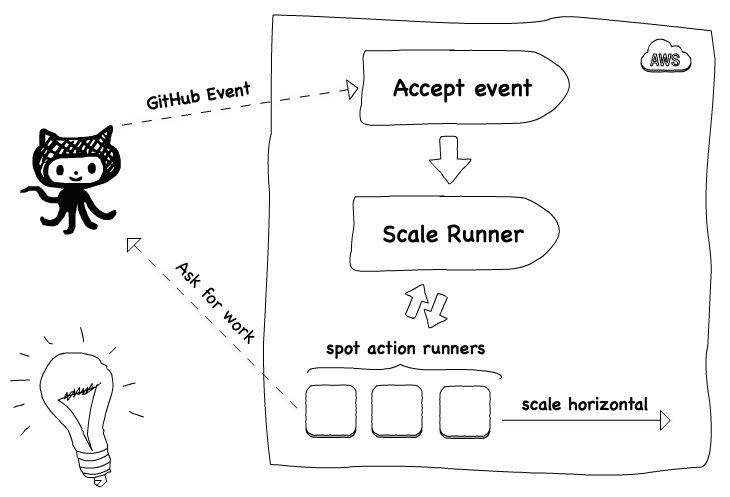
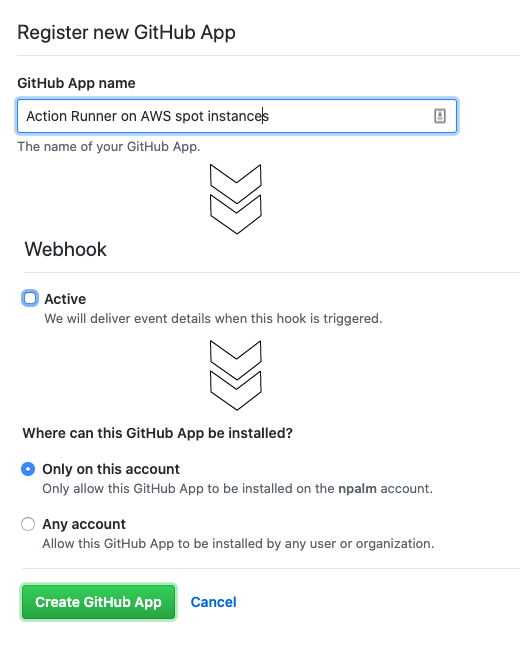
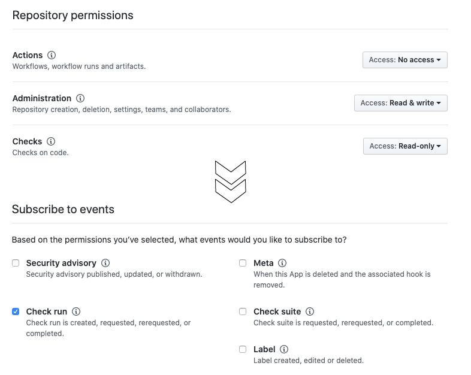
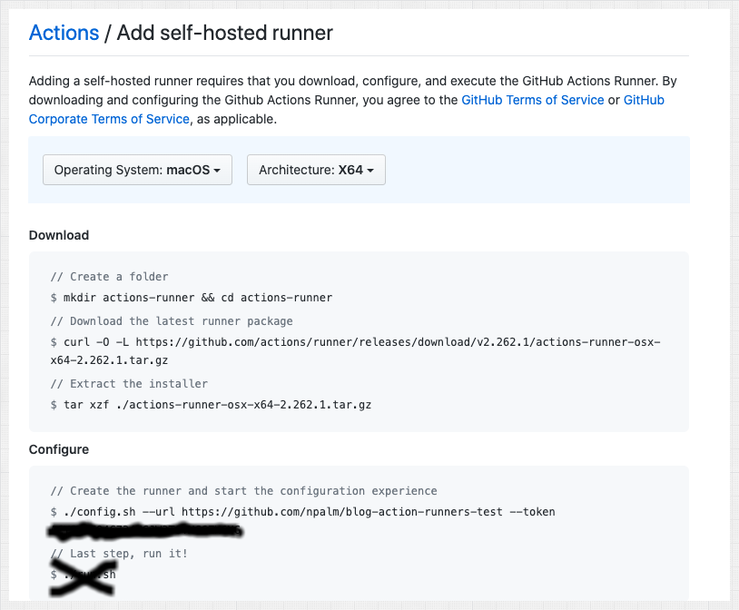
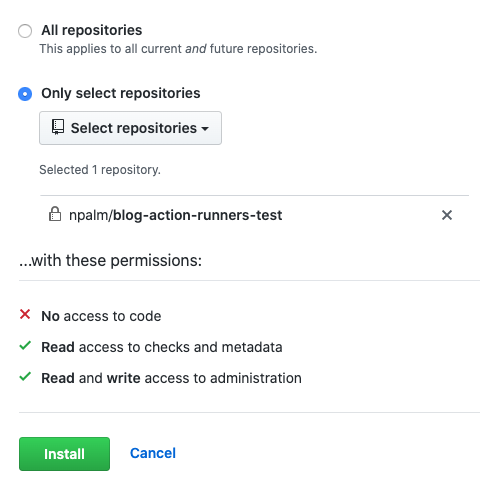
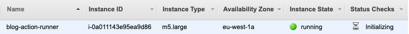
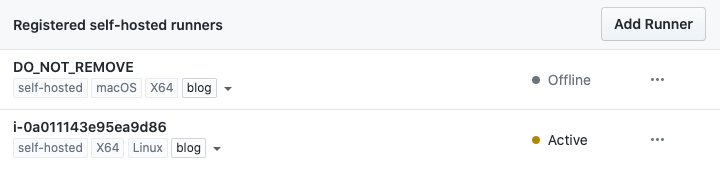
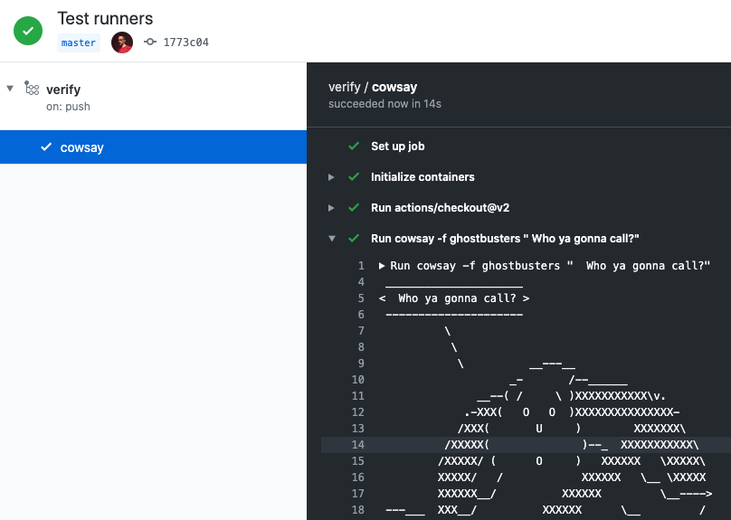
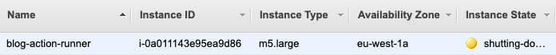

*This post explains how to run GitHub actions on self hosted scalable runners on AWS spot instances.*


<p style="text-align: right">
  <a href="https://github.com/philips-labs/terraform-aws-github-runner" target="sourcecode">
  <i class="fab fa-github" style="font-size: 200%">&nbsp;</i>Source code for this post</a></p>

## Introduction

Last year GitHub released [self hosted action runners](https://github.blog/2019-11-05-self-hosted-runners-for-github-actions-is-now-in-beta/). At that moment we immediately had a a quick look. At that time the feature was a bit limited, no API and only support on repo level. We were already able to automate the deployment of a single runner on dedicated for one repo with Terraform on AWS. But the clear drawback here is that you will pay AWS for hosting your instances even if you are not have any workload to execute. A bit later GitHub released an [API](https://github.blog/changelog/2020-01-27-github-actions-api-beta/), and last month [org level runners](https://github.blog/changelog/2020-04-22-github-actions-organization-level-self-hosted-runners/) was added. A good moment to have a second look on how to utilize self hosted runners, and scale the up and down based on workload.

## Why?

Why we are using self hosted runners? First of all we only use self hosted runners with our private or internal repositories, you should take care and think twice to use them with your public repositories. Having self hosted runners on your public repo's is perfectly possible but be-aware that any pull request will run on your hardware which could have serious security risks. As said we limit the use of self hosted runners to our non public repo's.

Next we by running on our own hardware we created our own trusted environment for our builds, we can connect to networks that are not available via the public runners. It also gives the option to fine tune the required hardware. Finally you control the costs, public runners are not free for non public repo's. By running them on your own hardware you can potentially save costs. The setup we will show will have almost no costs if there are no builds, and by executing the workflows on AWS spot instances we save again some pennies.

## The idea

The GitHub self hosted action runner is an agent that you need to install on any machine that needs to pickup and execute workflow. To connect the agent to GitHub you can either choose to register the agent on repo level or org level. For registration you request a registration token ([API](https://developer.github.com/v3/actions/self-hosted-runners/)) this token is used during the setup of agent. This part is easy to automate, but so let's have a look how we can orchestrate the process of creating runners.

In GitHub every time a workflow is triggered, a `check event` is created. Can we use this event to decide to scale a runner? Yes if we find a way to receive and listen for the event. Here there seems two options, using the webhook on repo or org level. Or use a GitHub app, we will use the GitHub app option. The GitHub app can sent for every `check run` event a message to our webhook. This webhook we can easy implement with a AWS Lambda function. This lambda can verify the event, run some other checks and decide to create a EC2 spot instance to facilitate the execution of the workflow. So we are limiting our selves to linux runners with docker support.



The last question we had was, how to scale down. Again we could listen for event and next try to scale down. But it would be not that easy to find out which instance we should remove, and maybe is already executing another workload. So we took a slightly different and much simpler approach. Just remove every x minutes runners that are not busy.

You might think why not using [Kubernetes](https://kubernetes.io/)? The reason for us is quit simple. First we would like to have a solution that could scale really from zero without making any costs. Secondly, with Kubernetes we enter a other model of running the GitHub agent, which is not supported (yet?). This only introduce some extra obstacles as managing docker in docker. For those those reason we took this simple and straightforward approach.

### Architecture

Before we build scalable runners on AWS, we discuss the architecture in a bit more detail. So on AWS we need several infrastructure components and a component to orchestrate the life cycle of the action runners. All infra structure will be create using [HashiCorp Terraform](https://www.terraform.io/). The orchestration layer is build with AWS lambda. All the lambda functions are written in [TypeScript](https://www.typescriptlang.org/) and compiled to NodeJs single file with [zeit ncc](https://github.com/zeit/ncc).

For the orchestration we build 4 different lambda's. Each lambda serves a different purpose. The action runners will run on AWS spot instances.


### Webhook

This lambda receives via the API gateway events sent via the GitHub App for each check run event. The lambda will check the event is signed with correct secret. Next it filters only for the check run event that require an action runner, other events are simply dropped. In other words the we only keep the events that are created once a new workflow is triggers. The events we accept are published on a SQS queue. Messages on the queue are delayed for 30 seconds by default. This allows possible idle action runners to start the workflow execution.

### Scale up

This lambda will receive messages from the SQS queue. For each message the lambda first verify the workflow is not started yet. When the workflow is still queued, the lambda will create an AWS spot instance via a launch template. Before creating the instance, a new runner will be registered to GitHub. The token will be temporary stored in the AWS parameter store (SSM). During the boot the AWS instance installs all requirement via a `user_data` script. The script will install docker, git and the action runner. The last one is fetch from a S3 bucket. Finally the runner is configured with parameters fetched from the parameter store, and ready to consume workloads.

### Scale down

This lambda is triggered by a cloud watch event. Every time it runs it will try to remove all the registered runners from GitHub. Only non active runners can be removed. Trying to remove an active one will fail, result in a 500 response. For all the removed runners from GitHub the lambda will terminate the EC2 spot instances so the bill stops. The scale up and scale down lambda share the same code base, and are released as one zip.

### Update Binary

This lambda will download the action runner binary to avoid unnecessary latency during creation of the runners. We found out in our first week of running our setup that downloading the action runner binary could take up to 15 minutes, therefore we build a simple lambda to cache the artifact in a bucket.

## Build it

### GitHub app

Time to build the idea. As mentioned above there are two scenario's two options for running the self hosted runner, repo level or org level. Our module supports both but for this blog we use the repo level runner as example. The example below is based on the [default example](https://github.com/philips-labs/terraform-aws-github-runner/tree/master/examples/default) in the Terraform module.

Everything starts with the event that we need to receive. So first we create a [GitHub App](https://github.com/settings/apps/new?name=AWS%20Spot%20Runner&public=false), for creating an app in you organization go to you organization settings and select GitHub apps. On the app creation page you only need to fill in the name, homepage, and un check the webhook. We will activate the webhook once we know our endpoint.



Next hit create app, you will be re-directed to the app overview page. Make a note of the following generated id's, and generate the ssh private key on the bottom of this page.
```
App ID:         12345
Client ID:      Iv1.abcd1234
Client secret:  some-secret
```

### Lambda artifacts

Before we can actually deploy the infrastructure we need to build or download the lambda functions. You can clone the module repo and use the script in `.ci/build.sh` to build the 3 lambda zip files. But the easier option is just to download the release artifacts from the repo. We even provide a small utility module to download the artifacts.

Create a new workspace (directory) and add the following terraform code.

```HCL
module "github-runner_download-lambda" {
  source  = "philips-labs/github-runner/aws//modules/download-lambda"
  version = "0.0.1"
}

  lambdas = [
    {
      name = "webhook"
      tag  = "v0.0.1"
    },
    {
      name = "runners"
      tag  = "v0.0.1"
    },
    {
      name = "runner-binaries-syncer"
      tag  = "v0.0.1"
    }
  ]
}
```

Next run `terraform init && terraform apply` the lambda artifacts will be download to your local machine.

### Deploy the action runners

Now we will create all required AWS resources and deploy the lambda functions. Besides this module we also need a vpc as well. We a VPC with a public [terraform AWS VPC](https://github.com/terraform-aws-modules/terraform-aws-vpc) module, you can use your own VPC as well. Create a new workspace and the code below to the `main.tf`.


```HCL
provider "aws" {
  region  = local.aws_region
  version = "2.61"
}

locals {
  environment = "blog"
  aws_region  = "eu-west-1"
}

module "vpc" {
  source  = "terraform-aws-modules/vpc/aws"
  version = "2.33"

  name = "vpc-blog"
  cidr = "10.0.0.0/16"

  azs             = ["eu-west-1a", "eu-west-1b", "eu-west-1c"]
  private_subnets = ["10.0.1.0/24", "10.0.2.0/24", "10.0.3.0/24"]
  public_subnets  = ["10.0.101.0/24", "10.0.102.0/24", "10.0.103.0/24"]

  enable_nat_gateway = true
  single_nat_gateway = true
  enable_s3_endpoint = true
}
```

You can already run and apply the terraform code, once we are complete with the setup. We can no add the GitHub action runner module. Events sent on to the webhook will be signed with a secret, therefore we generate a password with [Terraform random provider](https://www.terraform.io/docs/providers/random/). Ensure you set the variables for the lambda zip to the download lambda artifacts. And also add the ids, keys and base64 encoded secret for the GitHub app to the configuration.


```HCL
resource "random_password" "random" {
  length = 32
}

module "runners" {
  source  = "philips-labs/github-runner/aws"
  version = "0.0.1"

  aws_region  = local.aws_region
  vpc_id      = module.vpc.vpc_id
  subnet_ids  = module.vpc.private_subnets
  environment = local.environment

  github_app = {
    key_base64     = ""
    id             = ""
    client_id      = ""
    client_secret  = ""
    webhook_secret = random_password.random.result
  }

  webhook_lambda_zip                = "lambdas-download/webhook.zip"
  runner_binaries_syncer_lambda_zip = "lambdas-download/runner-binaries-syncer.zip"
  runners_lambda_zip                = "lambdas-download/runners.zip"
  enable_organization_runners       = false
}

output "lambda_syncer_name" {
  value = module.runners.binaries_syncer.lambda.function_name
}

output "webhook" {
  value = {
    secret   = random_password.random.result
    endpoint = module.runners.webhook.endpoint
  }
}
```

Save your configuration and run `terraform init` and `terraform apply`. Once Terraform is finished we will trigger the lambda function for the syncing the distribution one time manually to ensure our cache is filled.

```bash 
aws lambda invoke --function-name \
  $(terraform output -json lambda_syncer | jq -r) respone.json
```

### Configure the GitHub App part 2

Go back to your GitHub app and activate the webhook, and provide the endpoint and secret. Don't forget to save the changes. Now you can subscribe for events. Go to the section *permissions and events*, grant permission permission on repo as follow, check your terraform output for the values. (`terraform output -json webhook`).

1. Administration (read, write) - required to register runner.
2. Repository permissions Checks (read) - required to get check run events

Scroll al the way to the bottom and check the box to subscribe to the check event.





> Note: for org level runners you need to grant the administration permission on org level instead of repo level.

## Putting all together

We are all most done. As final step we will configure the self hosted runner for a test repo. First we create a test repo in [GitHub](https://github.com/new). In case you are using a runner and GitHub cannot find any runner that could run the workflow the build will directly fail. Since the scalable runners only create a runner once a event is received and remove the runners ofter an idle time we have by default no candidate runners registered. For the time being we have a work around. Just register a runner for the repo (or org) which we never will use, and start. The registered runner will avoid the workflow will directly fail. Be-aware the this runner will be removed by GitHub after 30 days.

Go to your repo settings (or org settings), select actions and choose "Add runner". Run the provided instruction for you OS, as name provide some descriptive name as "dummy". In case you provided the terraform module extra labels, provide them here as well.



THe final step is to install the GitHub app we have created. Go to your [app settings](https://github.com/settings/apps/self-hosted-aws-spot-runners) and select install, now you can choose how to install the app. To only receive relevant events we choose to be repo specific and install the app to our test repo.



Thats it, time to test. First create a simple action workflow in an empty directory.

```bash
mkdir -p .github/workflows
cat << EOF > .github/workflows/verify.yml
name: verify
on: [push]

jobs:
  cowsay:
    runs-on: self-hosted
    container: npalm/cowsay

    steps:
      - uses: actions/checkout@v2
      - run: cowsay -f ghostbusters "  Who ya gonna call?"
EOF
```

Initialize your current directory as GitHub repo and push all the content to GitHub.

```bash
git init
git remote add origin git@github.com:<YOUR_REPO>
git add --all .github
git commit -m "Test runners" .
git push origin master
```

You should after 30 seconds see your new spot instance starting in AWS.



A bit later, the runner should be registered to your GitHub repo.



And once registered it is normally a matter of seconds before the build starts.



Every 5 minutes the scale down lambda is executed, and if you not running any job you should see the runner is terminated.



In case you build runners are not starting or registering. The best you can do is follow the trace. In the GitHub app on there is an advanced settings page where you can see the events events sent to the webhook. When the event is not accepted double check the endpoint and secret. Next you can check the logs for the webhook and scale up lambda in cloud watch. Finally you can inspect the EC2 user data logging. Access via SSM is by default enabled. Just select connect to the instance and inspect the log `/var/log/user_data.log`.

## Final thoughts

... TODO ..